# Báo cáo kỹ thuật — SmartFit AI

> Đồ án môn **AI Product Development End-to-End** — Trường Đại học CNTT & TT Việt – Hàn (VKU).
> Báo cáo này giải thích **mã nguồn đang chạy** (không phải kế hoạch): dùng công nghệ gì, lý thuyết đằng sau, cấu trúc
> hệ thống và dữ liệu, các API hoạt động ra sao, cách vận hành app và tài liệu API Swagger.
> Số liệu cập nhật ngày **04/10/2026**, nhánh `Thien-Source`, BRD bản **2.10.1**.
>
> Các sơ đồ viết bằng **Mermaid**: GitHub hiển thị trực tiếp; trong VS Code cần tiện ích
> *Markdown Preview Mermaid Support*.

## Mục lục

1. [Tổng quan sản phẩm](#1-tổng-quan-sản-phẩm)
2. [Kiến trúc tổng thể](#2-kiến-trúc-tổng-thể)
3. [Công nghệ sử dụng](#3-công-nghệ-sử-dụng)
4. [Lý thuyết nền tảng](#4-lý-thuyết-nền-tảng)
5. [Backend `backend_api/`](#5-backend-backend_api)
6. [Dữ liệu](#6-dữ-liệu)
7. [Tài liệu API](#7-tài-liệu-api)
8. [Swagger API — tài liệu API thử trực tiếp](#8-swagger-api--tài-liệu-api-thử-trực-tiếp)
9. [Frontend `frontend_app/`](#9-frontend-frontend_app)
10. [Cách vận hành app (hướng dẫn người dùng)](#10-cách-vận-hành-app-hướng-dẫn-người-dùng)
11. [Trang thống kê Admin](#11-trang-thống-kê-admin)
12. [Triển khai và CI/CD](#12-triển-khai-và-cicd)
13. [Bảo mật và quyền riêng tư](#13-bảo-mật-và-quyền-riêng-tư)
14. [Kiểm thử](#14-kiểm-thử)
15. [Giới hạn hiện tại và hướng phát triển](#15-giới-hạn-hiện-tại-và-hướng-phát-triển)
16. [Phụ lục: thuật ngữ](#16-phụ-lục-thuật-ngữ)

---

## 1. Tổng quan sản phẩm

**SmartFit AI** là ứng dụng lập **kế hoạch ăn uống và tập luyện 3 ngày** cho người Việt: món ăn gia đình Việt Nam,
bài tập không cần dụng cụ, tính theo thể trạng và mục tiêu của từng người.

| Tính năng | Mô tả ngắn | Nơi xử lý |
| --- | --- | --- |
| Tạo kế hoạch 3 ngày | Nhập hồ sơ (tuổi, giới tính, chiều cao, cân nặng, mức vận động, mục tiêu, dị ứng/chấn thương/bệnh nền) → 3 ngày × 3 bữa + 1 buổi tập/ngày | `POST /api/v1/generate-plan` |
| Mục tiêu dinh dưỡng | BMI, BMR, TDEE, calo mục tiêu, gram đạm/tinh bột/béo | `daily-target.ts` (backend) |
| Đổi món | Đổi 1 bữa lấy món khác cùng bữa, calo lệch ≤ ±10 % | `POST /api/v1/meals/swap` |
| Đổi bài tập | Đổi 1 động tác lấy động tác **nhẹ hơn** cùng nhóm cơ | `POST /api/v1/exercises/swap` |
| Phản hồi cuối ngày | 3 câu hỏi (độ nặng buổi tập, tình trạng cơ thể, ăn uống) → điều chỉnh ngày kế tiếp; ngày 3 → kế hoạch mới | `POST /api/v1/feedback` |
| Danh sách đi chợ | Gộp nguyên liệu 3 ngày theo nhóm, đánh dấu "đã mua"/"đã có" | Backend tính, app lưu trạng thái |
| Tài khoản và lịch sử | Đăng nhập Google (hoặc giả lập khi phát triển), xem lại các kế hoạch cũ trên mọi thiết bị, xoá tài khoản | `/auth/google`, `/plans/history`, `DELETE /me` |
| Trang thống kê Admin | Số kế hoạch, tỉ lệ Gemini/thực đơn mẫu, nhật ký lỗi Gemini theo tháng | `/admin` |

**Địa chỉ chạy thật**

| Thành phần | URL |
| --- | --- |
| App bản web | https://alenjason.github.io/AI-Product-Development-End-to-End/ |
| Chính sách quyền riêng tư | https://alenjason.github.io/AI-Product-Development-End-to-End/privacy.html |
| Backend API | https://smartfit-api.vercel.app |
| Swagger UI | https://smartfit-api.vercel.app/docs |
| Kiểm tra sức khoẻ backend | https://smartfit-api.vercel.app/health |
| Trang thống kê Admin | https://smartfit-api.vercel.app/admin |

**Nguyên tắc thiết kế xuyên suốt**

1. **Không tin AI**: mọi kết quả Gemini đều được backend kiểm lại bằng code (cấu trúc, calo, dị ứng, chấn thương). Sai
   → gọi lại hoặc dùng thực đơn mẫu. Người dùng luôn nhận được kế hoạch hợp lệ.
2. **Luôn chạy được không cần khoá**: không có `GEMINI_API_KEY` → dùng dữ liệu soạn sẵn; `AUTH_MODE=mock` → đăng nhập giả
   lập. Toàn bộ test chạy không cần mạng.
3. **Dữ liệu sức khoẻ không được lưu phía server**: ghi chú dị ứng, chấn thương, bệnh nền và việc mang thai không
   được ghi vào DB hay log, kể cả dưới dạng câu cảnh báo trong kế hoạch đã lưu. Chúng chỉ được gửi cho Gemini để lập
   kế hoạch ([mục 6.5](#65-dữ-liệu-nằm-ở-đâu)).
4. **Backend là nguồn sự thật**: calo mục tiêu, danh sách đi chợ, ID món/bài luôn do backend tính lại, không lấy từ app hay
   từ Gemini.

---

## 2. Kiến trúc tổng thể

Hệ thống theo mô hình **client–server 3 tầng** (3-tier): tầng trình bày, tầng ứng dụng (nghiệp vụ), tầng dữ liệu, cộng
hai dịch vụ bên ngoài của Google. Mục 2.1–2.2 là **kiến trúc logic** (hệ thống gồm những phần nào, phần nào gọi phần
nào). Mục 2.3 là **sơ đồ triển khai**: mỗi phần chạy trên máy chủ nào. Đây là hai góc nhìn khác nhau của cùng một hệ
thống.

### 2.1 Kiến trúc logic: client–server 3 tầng

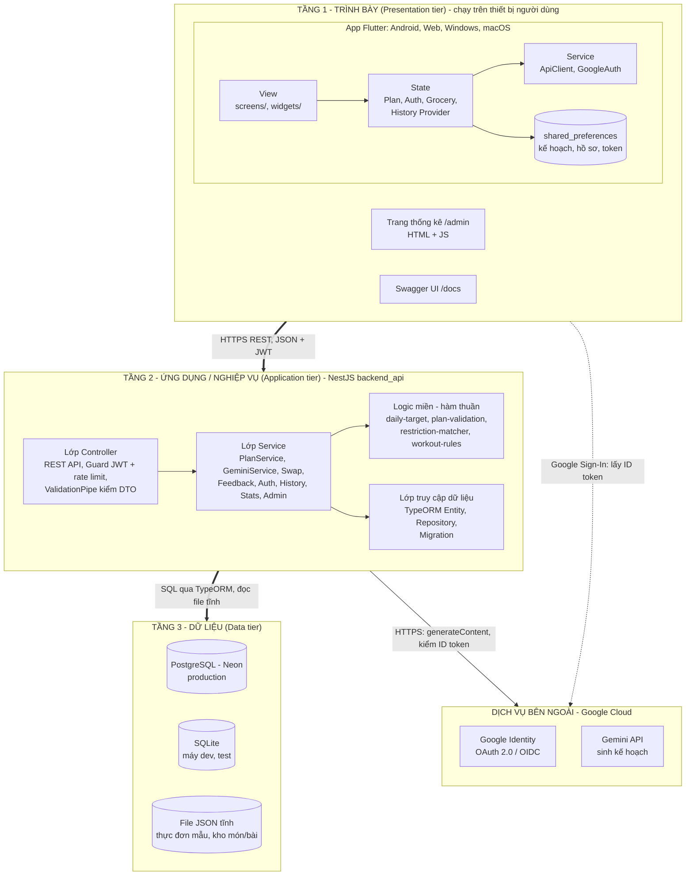

| Tầng | Thành phần | Công nghệ | Mã nguồn | Chạy ở đâu |
| --- | --- | --- | --- | --- |
| Trình bày | App người dùng | Flutter / Dart, `provider` | `frontend_app/lib/` | Điện thoại Android, trình duyệt, máy tính |
| Trình bày | Trang thống kê Admin | HTML, CSS, JS thuần | `backend_api/src/admin/admin-page.ts` (backend gửi xuống trình duyệt) | Trình duyệt |
| Trình bày | Swagger UI | `swagger-ui-dist` | Sinh từ decorator bởi `@nestjs/swagger` | Trình duyệt |
| Ứng dụng | REST API và nghiệp vụ | NestJS, TypeScript | `backend_api/src/` | Vercel Serverless Function |
| Dữ liệu | Cơ sở dữ liệu | PostgreSQL (Neon) / SQLite | `backend_api/src/database/` | Neon / máy dev |
| Dữ liệu | Dữ liệu tĩnh | JSON | `backend_api/src/plan/data/` | Đóng gói cùng backend |
| Bên ngoài | AI tạo sinh, đăng nhập | Gemini API, Google Identity | — | Google Cloud |

**Vì sao chia 3 tầng như vậy**

- **Tầng trình bày không bao giờ chạm DB hay Gemini.** Mọi truy cập đều đi qua tầng 2. Khoá Gemini, chuỗi kết nối DB và
  khoá ký JWT chỉ nằm ở tầng 2. Mọi dữ liệu từ app đều bị kiểm lại ở tầng 2 (mục 5.4).
- **Tầng 2 không giữ trạng thái (stateless).** Phiên đăng nhập nằm trong JWT, bộ đếm rate limit và thống kê nằm trong DB.
  Không có gì giữ trong RAM giữa các request, nên tầng 2 chạy được dạng serverless: Vercel bật bao nhiêu bản chạy song
  song cũng được.
- **Tầng 3 đổi được mà không sửa nghiệp vụ.** Cùng entity và repository chạy trên SQLite khi phát triển và PostgreSQL khi
  chạy thật. Chỉ có migration là viết riêng cho từng DB.
- Trình duyệt chỉ là client. Trang `/admin` và `/docs` là **route của chính backend**, không phải server riêng.

### 2.2 Kiến trúc bên trong từng tầng

| Tầng | Mẫu kiến trúc | Các lớp, theo chiều gọi | Chi tiết |
| --- | --- | --- | --- |
| App Flutter | Phân lớp, gần với **MVVM**: Provider đóng vai ViewModel | View (`screens/`, `widgets/`) → State (`providers/`) → Service (`ApiClient`, `GoogleAuth`) → Model (`models/`) | [Mục 9](#9-frontend-frontend_app) |
| Backend NestJS | **Layered architecture** chia theo module, dùng Dependency Injection | Controller (+ Guard, Pipe) → Service → logic miền (hàm thuần) → Repository / Entity (TypeORM) | [Mục 5](#5-backend-backend_api) |
| Dữ liệu | Quan hệ, thay đổi schema bằng migration | 5 bảng nghiệp vụ + bảng `migrations` | [Mục 6](#6-dữ-liệu) |

Quy tắc phụ thuộc: lớp trên chỉ gọi lớp ngay dưới. Màn hình Flutter không gọi `ApiClient` trực tiếp mà đi qua Provider.
Controller NestJS không truy cập DB mà gọi Service. Logic miền là hàm thuần (không I/O), nên test được mà không cần DB hay
mạng.

### 2.3 Sơ đồ triển khai (deployment view)

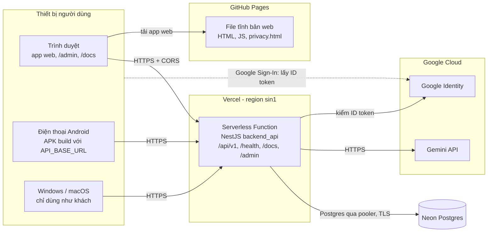

- Bản web là file tĩnh trên GitHub Pages: trình duyệt tải app về rồi gọi thẳng backend trên Vercel (backend cho phép
  origin này qua CORS).
- **Windows** chưa có plugin `google_sign_in`; **macOS** cần nhóm ký Apple mới bật được đăng nhập Google. Cả hai chỉ dùng
  như khách.
- App Android, Windows, macOS chỉ trỏ tới backend thật khi build với
  `--dart-define=API_BASE_URL=https://smartfit-api.vercel.app` (thêm `GOOGLE_WEB_CLIENT_ID` để đăng nhập Google). Bản
  build do CI tạo **không** có tham số này, nên trỏ về `localhost` (máy ảo Android: `10.0.2.2`). Bản đó chỉ dùng để
  kiểm tra build được, không dùng để phát cho người dùng.
- Quy trình CI/CD (GitHub Actions, Vercel tự deploy) nằm ở [mục 12](#12-triển-khai-và-cicd).

### 2.4 Cấu trúc monorepo

```text
AIE_T_E/
├── BRD.md                    # Đặc tả yêu cầu (bản 2.10.1, Approved) — nguồn sự thật về phạm vi và hợp đồng JSON
├── README.md                 # Giới thiệu, cách chạy, changelog
├── .github/workflows/
│   ├── backend.yml           # CI backend: Node 24/26 + Postgres 17 + type-check ai_workspace
│   └── frontend.yml          # CI app: analyze + test, build APK/web/Windows/macOS, deploy GitHub Pages
├── backend_api/              # NestJS (TypeScript, ESM)
│   ├── src/
│   │   ├── main.ts           # Điểm vào: export handler cho Vercel, listen() khi chạy máy
│   │   ├── app.setup.ts      # ValidationPipe, CORS, Swagger, trust proxy — dùng chung cho main và test
│   │   ├── app.module.ts     # Gộp mọi module
│   │   ├── plan/             # Tạo kế hoạch, Gemini, kiểm tra, thực đơn mẫu, kho món/bài
│   │   │   ├── adjust/       # Đổi món, đổi bài, feedback
│   │   │   ├── dto/          # Lớp request/response (class-validator + Swagger)
│   │   │   ├── enums/        # Mã cố định: bữa, nhóm cơ, tag, đơn vị…
│   │   │   └── data/         # sample-plan.json, swap-meals.json, swap-exercises.json, restriction-keywords.json
│   │   ├── auth/             # Đăng nhập Google / giả lập, JWT, guard
│   │   ├── history/          # Lịch sử kế hoạch
│   │   ├── database/         # TypeORM: entity, migration SQLite + Postgres
│   │   ├── rate-limit/       # Giới hạn tần suất lưu trong DB
│   │   ├── stats/            # Bộ đếm theo ngày + nhật ký gọi Gemini
│   │   └── admin/            # Đăng nhập Admin, API thống kê, trang /admin
│   ├── test/                 # e2e (supertest), server Gemini giả, fixture
│   ├── scripts/              # migrate, smoke test, đo Gemini thật, tạo mã băm Admin
│   └── vercel.json
├── frontend_app/             # Flutter (package my_ai_app)
│   ├── lib/
│   │   ├── main.dart         # Khởi tạo provider, MainShell điều hướng bằng enum
│   │   ├── config/           # Địa chỉ backend
│   │   ├── models/           # Model hợp đồng API + luật hồ sơ, lịch, tìm kiếm
│   │   ├── providers/        # PlanProvider, AuthProvider, GroceryProvider, HistoryProvider
│   │   ├── services/         # ApiClient, ApiException, GoogleAuth
│   │   ├── screens/          # Các màn hình
│   │   ├── widgets/          # Form hồ sơ, sheet feedback, đăng nhập, khung app
│   │   └── theme/
│   ├── test/                 # widget/unit test + fixtures/ (JSON thật do backend xuất)
│   ├── integration_test/     # Test chạy app thật với backend thật (thủ công)
│   └── web/privacy.html
└── ai_workspace/             # Node/TS riêng: thử nghiệm prompt Gemini trước khi đưa vào backend
```

---

## 3. Công nghệ sử dụng

### 3.1 Backend

| Thư viện | Phiên bản | Vai trò | Vì sao chọn |
| --- | --- | --- | --- |
| Node.js | 24 / 26 (CI chạy cả hai) | Runtime | LTS, có `import.meta.main`, chạy được TypeScript ESM |
| TypeScript | 6.0 | Ngôn ngữ | Kiểu tĩnh cho DTO, entity, hợp đồng JSON |
| NestJS (`@nestjs/core`, `common`, `platform-express`) | 12 | Framework | Module + DI + Guard + Pipe rõ ràng, sinh Swagger từ decorator |
| `class-validator`, `class-transformer` | 0.15 / 0.5 | Kiểm dữ liệu vào | Khai báo luật ngay trên lớp DTO, dùng lại cho cả kết quả Gemini |
| `@nestjs/swagger` | 12 | Tài liệu OpenAPI | Swagger UI tại `/docs`, JSON tại `/docs-json` |
| `@nestjs/config` | 12 | Đọc `.env` | |
| `@nestjs/jwt` | 12 | Ký / kiểm JWT HS256 | |
| TypeORM + `@nestjs/typeorm` | 1.1 / 12 | ORM, migration | Cùng entity cho SQLite (máy) và Postgres (production) |
| `better-sqlite3` | 12 | DB khi phát triển và test | Không cần cài server, chạy trong RAM cho test |
| `pg` | 8 | Driver Postgres | Neon trên production |
| `google-auth-library` | 11 | Kiểm Google ID token | Kiểm chữ ký, hạn, `audience` |
| `@google/genai` | 2.24 | SDK Gemini | SDK chính thức mới (SDK cũ `@google/generative-ai` đã ngừng) |
| Vitest + Supertest | 4 / 7 | Unit + e2e test | Chạy thẳng `.ts`, nhanh |
| oxlint | 1.58 | Lint có kiểu | |
| PGlite | (chỉ khi test máy) | Postgres chạy trong tiến trình | Test migration Postgres không cần Docker |

### 3.2 Frontend

| Thư viện | Phiên bản | Vai trò |
| --- | --- | --- |
| Flutter / Dart | Flutter 3.47.5 (CI), Dart SDK ^3.13 | Một mã nguồn cho Android, Web, Windows, macOS |
| `provider` | 6.1 | Quản lý trạng thái (ChangeNotifier) |
| `http` | 1.6 | Gọi REST |
| `shared_preferences` | 2.5 | Lưu kế hoạch, hồ sơ, token trên máy |
| `google_sign_in` (+ `google_sign_in_web`) | 7.2 / 1.1 | Đăng nhập Google |
| `flutter_lints`, `integration_test` | 6.0 / SDK | Lint và test tích hợp |

### 3.3 Hạ tầng

| Dịch vụ | Dùng cho | Gói |
| --- | --- | --- |
| **Vercel** | Chạy backend dạng serverless, region `sin1` | Hobby (miễn phí) |
| **Neon** | PostgreSQL có connection pooling | Free |
| **GitHub Pages** | Host bản web Flutter | Miễn phí |
| **GitHub Actions** | CI, build 4 nền tảng, deploy Pages | Miễn phí (repo công khai) |
| **Google AI Studio (Gemini API)** | Sinh kế hoạch | Free tier: 20 lượt/ngày **mỗi model** |
| **Google Cloud OAuth** | Đăng nhập Google | Miễn phí, ứng dụng đã ở trạng thái *In production* |

---

## 4. Lý thuyết nền tảng

### 4.1 Dinh dưỡng: từ hồ sơ tới calo mục tiêu

Hàm thuần `computeDailyTarget()` trong `backend_api/src/plan/daily-target.ts`.

| Đại lượng | Công thức | Ý nghĩa |
| --- | --- | --- |
| **BMI** | `cân nặng (kg) / chiều cao (m)²` | Chỉ số khối cơ thể; < 18,5 là thiếu cân |
| **BMR** (Mifflin–St Jeor) | Nam: `10·kg + 6,25·cm − 5·tuổi + 5`<br/>Nữ: `10·kg + 6,25·cm − 5·tuổi − 161` | Năng lượng tối thiểu cơ thể tiêu hao khi nghỉ hoàn toàn |
| **TDEE** | `BMR × hệ số vận động` — ít vận động 1,2 · nhẹ 1,375 · năng động 1,55 | Tổng năng lượng tiêu hao một ngày |
| **Calo mục tiêu** | `max(TDEE + điều chỉnh, BMR)` — giảm cân −300 · tăng cơ +250 · giữ dáng 0 | Không bao giờ thấp hơn BMR (an toàn) |
| **Macro** | Đạm 25 % và tinh bột 45 % (chia 4 kcal/g), béo 30 % (chia 9 kcal/g) | Gram mỗi chất trong ngày |

Mifflin–St Jeor được chọn vì là phương trình ước lượng BMR có sai số nhỏ nhất ở người trưởng thành trong các so sánh
phổ biến, chỉ cần 4 thông số dễ nhập. Mức −300/+250 kcal là thâm hụt/thặng dư vừa phải (khoảng 0,25–0,3 kg/tuần), phù
hợp người dùng phổ thông không có chuyên gia theo dõi.

**Ví dụ tính tay** (hồ sơ mẫu trong `frontend_app/test/fixtures/profile.json`: nữ, 22 tuổi, 168 cm, 62 kg, vận động
nhẹ, giảm cân):

```text
BMI    = 62 / 1,68²                         = 21,97  → 22
BMR    = 10·62 + 6,25·168 − 5·22 − 161      = 1399
TDEE   = 1399 × 1,375                       = 1923,6 → 1924
Mục tiêu = max(1923,6 − 300 ; 1399)         = 1623,6 → 1624 kcal
Đạm    = 1624 × 0,25 / 4 = 101,5 → 102 g
Tinh bột = 1624 × 0,45 / 4 = 182,7 → 183 g
Béo    = 1624 × 0,30 / 9 = 54,1  → 54 g
```

Kết quả này khớp đúng `daily_target` trong `generate_plan.json` — file JSON thật do backend xuất ra và app dùng để test.

**Luật an toàn của hồ sơ** (`profile-safety.ts`, app có bản sao trong `profile_rules.dart`):

- Tuổi 18–100, chiều cao 100–250 cm, cân nặng 30–250 kg.
- Không cho chọn **giảm cân** khi BMI (chưa làm tròn) < 18,5 hoặc khi đang mang thai/cho con bú.
- `pregnant_or_breastfeeding` chỉ áp dụng cho nữ.

### 4.2 Kiểm tra một kế hoạch có hợp lệ không

Mọi kế hoạch — từ Gemini, từ thực đơn mẫu, hay do app gửi lên khi đổi món — đều đi qua cùng một hàm
`findPlanViolations(plan, target)` (`plan-validation.ts`):

| Luật | Ngưỡng | Lý do |
| --- | --- | --- |
| Calo từng bữa theo **tỉ lệ** mục tiêu ngày | Sáng 15–35 %, trưa 25–45 %, tối 25–45 % | Ngưỡng cố định cũ (250–600 kcal) làm người cần 2800 kcal không bao giờ đủ |
| Tổng calo ngày | `[max(85 % mục tiêu, BMR) ; 110 % mục tiêu]` | Không ăn dưới BMR, không vượt quá xa |
| Calo khớp macro | Chênh lệch giữa `calo` và `4P + 4C + 9F` ≤ 15 % calo | Bắt lỗi Gemini "bịa" số |
| Không trùng món | Trong cả 3 ngày | Thực đơn đa dạng |
| Mã cố định | Bữa, nhóm cơ, tag, đơn vị, nhóm nguyên liệu phải thuộc danh sách | Mã lạ → **báo lỗi**, không bao giờ bỏ qua kiểm tra |
| Dị ứng | Không có nguyên liệu khớp từ khoá dị ứng | Kiểm lại ngay cả khi prompt đã dặn |
| Chấn thương | Không có động tác mang tag cần tránh | Như trên |

### 4.3 Thực đơn mẫu và co giãn khẩu phần

`data/sample-plan.json` là kế hoạch 3 ngày soạn tay cho khoảng **1550 kcal/ngày**. Khi không dùng được Gemini:

1. **Lọc theo hạn chế** — `filterPlanByRestrictions()` thay món chứa chất dị ứng bằng món trong kho `swap-meals.json`
   (21 món), thay động tác vướng chấn thương bằng động tác trong `swap-exercises.json` (41 động tác).
2. **Hạ mức động tác** theo hồ sơ (mục 4.4).
3. **Co giãn khẩu phần từng ngày** (`meal-scaling.ts`): nhân lượng nguyên liệu, calo và macro của mọi bữa với
   `mục tiêu / tổng calo ngày`, để người có mục tiêu 2600 kcal không bị ăn dưới BMR.
4. **Kiểm lại** bằng đúng `findPlanViolations()`.

Ngoài ra món mẫu và món trong kho phải giữ tỉ lệ năng lượng gần 25/45/30: test `sample-plan.spec.ts` yêu cầu mỗi ngày
lệch ≤ 3 điểm phần trăm (kể cả sau khi thay món vì dị ứng), `swap-pools.spec.ts` yêu cầu mỗi món lệch ≤ 8 điểm.

### 4.4 Bài tập: mức khó, tag và chấn thương

Mỗi động tác trong kho có **mức khó 1–3** và **tag tải khớp**:

| Tag | Nghĩa | Ví dụ |
| --- | --- | --- |
| `jumping` | Bật nhảy | Jumping Jacks, Burpee, Squat nhảy |
| `kneeling` | Chống/quỳ gối | Chống đẩy khuỵu gối, Bird-dog |
| `knee_bend` | Gập gối chịu sức nặng | Squat tay không, Lunge lùi, Wall sit |
| `wrist_load` | Dồn lực cổ tay | Chống đẩy tiêu chuẩn, chống đẩy nghiêng trên ghế |
| `back_load` | Tải lưng | Superman |
| `overhead` | Tay qua đầu | Pike push-up, Wall slide |

**Mức tối đa theo hồ sơ** (`maxExerciseLevel()`):

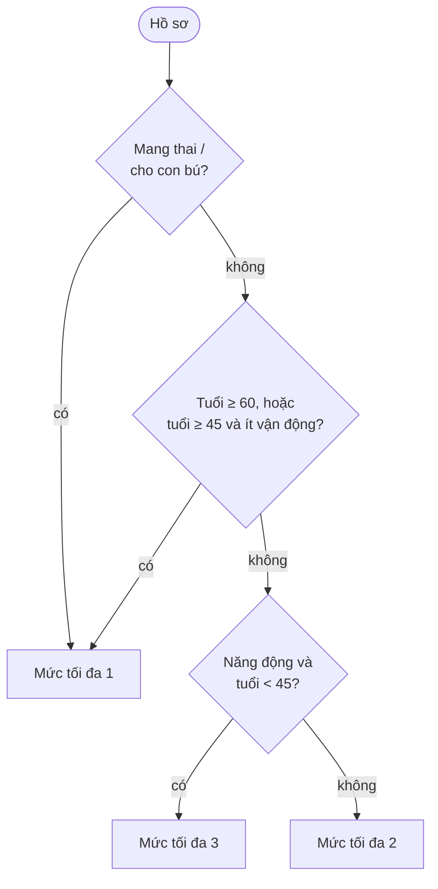

`capWorkoutLevel()` thay mọi động tác vượt mức bằng động tác cùng nhóm cơ, mức thấp hơn, không vướng chấn thương, giữ số
hiệp. Áp dụng cho thực đơn mẫu **và** kết quả Gemini (không gọi Gemini lại).

**Tag suy ra từ tên** (`addImpliedTags()`): Gemini có thể trả "Squat" mà quên tag `knee_bend`. Backend không tin tag do
Gemini hay app ghi, mà luôn thêm tag theo từ khoá trong tên (`squat`, `lunge`, `ngồi xổm` → `knee_bend`; `nhảy`,
`jump` → `jumping`; `quỳ`, `khuỵu gối` → `kneeling`).

### 4.5 Bộ nhận diện hạn chế (dị ứng, chấn thương) bằng từ khoá

`restriction-matcher.ts` + `data/restriction-keywords.json` (16 nhóm dị ứng, 5 nhóm chấn thương). Ví dụ:

- "Hải sản" → tránh nguyên liệu chứa `tôm, tép, cua, ghẹ, mực, bạch tuộc, nghêu, ngao, sò, ốc, hến, cá, mắm`.
- "Đau gối" → tránh tag `jumping, kneeling, knee_bend`.
- "Cổ tay" → tránh `wrist_load`.

**Vấn đề dấu tiếng Việt:** bỏ dấu thì "cá" (fish) trùng "cà" (cà chua), "bò" trùng "bơ". Vì vậy:

- Tên nguyên liệu luôn so **có dấu**.
- Chữ người dùng gõ **không dấu** ("hai san") thì mới so không dấu; `đ` được thay tay thành `d` (Unicode NFD không tách
  được chữ `đ`).
- Hàm trả về từ khoá/tag đã nhận ra và cờ `hasUnrecognized` (có chữ không hiểu được), **không bao giờ** trả lại chữ của
  người dùng — để chữ đó không lọt vào log hay cảnh báo.

Thực đơn mẫu chỉ lọc được những gì từ khoá nhận ra, nên khi dùng thực đơn mẫu, kế hoạch luôn kèm cảnh báo nhắc người dùng
tự kiểm tra.

### 4.6 AI tạo sinh: Gemini với đầu ra có cấu trúc

| Kỹ thuật | Cách làm trong mã | Lý do |
| --- | --- | --- |
| **JSON mode** | `responseMimeType: 'application/json'` | Gemini trả JSON thuần, parse được ngay |
| **Hợp đồng chặt** | Prompt liệt kê đúng các khoá, mã cố định, ngưỡng calo đọc từ chính enum và hằng số của backend | Prompt và bộ kiểm không lệch nhau |
| **Kiểm sau sinh** | `parsePlanContent()` = class-validator + `findPlanViolations()` + kiểm dị ứng | LLM có thể sai số, sai mã, quên dị ứng |
| **Nói rõ điều sẽ bị loại** | `ingredientAvoidRule()`, `exerciseAvoidRule()`, `exerciseLevelRule()` | Khi chỉ ghi "dị ứng hải sản", Gemini từng hiểu hẹp và cho cá nước ngọt |
| **Chống prompt injection** | Chữ người dùng đặt trong khối `<du_lieu_nguoi_dung>…</du_lieu_nguoi_dung>`, `sanitizeUserText()` xoá `<` `>` và gộp khoảng trắng, giới hạn 300 ký tự | Người dùng không đóng được khối dữ liệu để chèn lệnh |
| **Tắt "suy nghĩ"** | `thinkingBudget: 0` (`GEMINI_THINKING=off`) | Đo thật: tạo plan 8–13 s khi tắt, 37–42 s khi để model tự suy nghĩ |
| **Feedback không chứa chữ người dùng** | Câu tóm tắt feedback gửi Gemini ở ngày 3 dựng từ mã cố định | Không có kênh chèn lệnh qua feedback |

### 4.7 Gọi lại và model dự phòng (độ tin cậy)

Gói miễn phí của Gemini hay gặp **503 quá tải**, **429 hết lượt** (20 lượt/ngày/model) và **chậm**. `generateWithRetry()`
(`gemini-retry.ts`) xử lý theo loại lỗi:

| Kết quả một lần gọi | Phân loại | Lần gọi kế tiếp |
| --- | --- | --- |
| JSON hợp lệ, đạt hợp đồng | `ok` | Dừng, trả kết quả |
| JSON hỏng / sai hợp đồng | `invalid` | Gọi lại **model chính một lần**, sau đó chuyển model dự phòng |
| HTTP 503 | `overloaded` | Chuyển **ngay** sang model dự phòng |
| HTTP 429 | `quota` | Chuyển ngay sang model dự phòng |
| Lỗi khác | `error` | Chuyển ngay sang model dự phòng |
| Hết giờ (`AbortError` hoặc 504 `DEADLINE_EXCEEDED`) | `timeout` | **Dừng**, dùng thực đơn mẫu |

- Tối đa **4 lần gọi** (1 + 3 lần gọi lại) khi có model dự phòng; 2 lần khi tắt (`GEMINI_FALLBACK_MODEL=off`).
- **Ngân sách thời gian:** mỗi lần gọi ≤ `GEMINI_TIMEOUT_MS`, cả chuỗi ≤ `GEMINI_TOTAL_TIMEOUT_MS`; chỉ gọi lại khi còn
  ≥ 5 s; lần gọi lại chỉ được phần thời gian còn lại. Người dùng không bao giờ chờ quá giới hạn tổng.
- Không truyền `retryOptions` cho SDK (SDK sẽ tự gọi lại tới 5 lần, chờ tới 60 s).
- Mỗi lần gọi được ghi vào bảng `gemini_calls` (model, lần thứ mấy, kết quả, mã HTTP, thời gian) — không ghi nội dung.

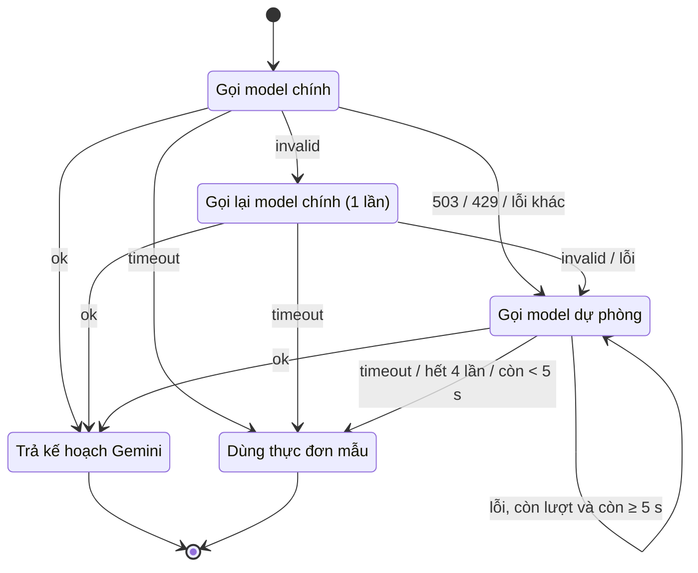

### 4.8 Xác thực: OpenID Connect + JWT

- **Google ID token** là một JWT do Google ký (RS256), chứa `sub` (mã người dùng cố định), `email`, `name`, `aud`
  (Client ID của app), `exp`. Backend dùng `google-auth-library` kiểm chữ ký bằng khoá công khai của Google, kiểm hạn, và
  **luôn kiểm `audience`** — thiếu bước này thì token Google cấp cho app khác cũng đăng nhập được.
- Sau khi kiểm, backend tìm hoặc tạo người dùng theo `google_sub` rồi ký **access token riêng** (HS256, khoá
  `JWT_SECRET` ≥ 32 ký tự, hạn mặc định 7 ngày). Payload chỉ có `sub` = ID người dùng.
- Mỗi request có token, guard **đọc lại người dùng từ DB** → tài khoản đã xoá thì token cũ bị 401 ngay.
- **Chế độ giả lập** (`AUTH_MODE=mock`, mặc định khi phát triển): `id_token` dạng `mock:<email>` được chấp nhận; mọi bước
  sau (tạo người dùng, JWT, lịch sử) là thật. Backend **từ chối khởi động** nếu `NODE_ENV=production` + mock, trừ khi đặt
  `ALLOW_MOCK_AUTH=true`.
- Hai loại guard: `JwtAuthGuard` (bắt buộc đăng nhập) và `OptionalJwtAuthGuard` (không có header → khách; header sai → 401,
  không âm thầm coi là khách).

### 4.9 Giới hạn tần suất (rate limiting) kiểu cửa sổ cố định

Serverless không có bộ nhớ dùng chung giữa các lần chạy, nên bộ đếm nằm trong **DB** (bảng `rate_limits`):

```text
khoá   = SHA-256(nhóm + danh tính)        # danh tính: user id nếu đã đăng nhập, IP nếu là khách (IPv6 gộp theo /64)
INSERT … ON CONFLICT (key) DO UPDATE      # một câu SQL nguyên tử, không có race giữa các function chạy song song
   hits = (cửa sổ hết hạn ? 1 : hits + 1),
   window_ends_at = (cửa sổ hết hạn ? now + độ dài : giữ nguyên)
RETURNING hits, window_ends_at
hits > giới hạn → 429 + header Retry-After
```

| Nhóm | Mặc định | Áp dụng |
| --- | --- | --- |
| `plan` | 5 lần / 10 phút | `generate-plan` (tốn lượt Gemini) |
| `adjust` | 30 lần / 10 phút | đổi món, đổi bài, feedback (dùng chung) |
| `admin` | 5 lần / 15 phút theo IP | đăng nhập Admin (chống dò mật khẩu) |

Trên Vercel đặt `TRUST_PROXY_HOPS=1` để Express lấy IP thật từ `X-Forwarded-For` (chỉ tin đúng một proxy, người dùng
không giả IP được).

### 4.10 Băm mật khẩu Admin bằng scrypt

- Mật khẩu Admin **không bao giờ** nằm trên server dạng chữ: biến môi trường chỉ chứa
  `scrypt$32768$8$1$<salt>$<hash>` (N = 2¹⁵, r = 8, p = 1). Mã băm tạo trên máy người vận hành bằng
  `npm run admin:hash`.
- scrypt là hàm băm **tốn bộ nhớ** (~32 MB mỗi lần) → dò mật khẩu bằng GPU rất đắt. Salt ngẫu nhiên chống bảng tra sẵn.
- So sánh bằng `timingSafeEqual` (thời gian không phụ thuộc vị trí sai). Sai tên hay sai mật khẩu đều trả **cùng một câu**
  → không dò được tên đăng nhập.
- Token Admin ký bằng khoá `HMAC(JWT_SECRET, mã băm mật khẩu)`, `aud = smartfit-admin`, hạn 8 giờ → **đổi mật khẩu hay
  đổi tên là mọi phiên cũ hết hiệu lực**, và token người dùng không mở được trang Admin (ngược lại cũng vậy).

### 4.11 Ràng buộc của môi trường serverless

| Ràng buộc trên Vercel | Cách xử lý trong mã |
| --- | --- |
| Function không giữ tiến trình lâu dài, không `listen()` | `main.ts` export mặc định một handler `(req, res)`; chỉ gọi `listen()` khi chạy trực tiếp (`import.meta.main`) |
| Bundler chỉ đóng gói file được tham chiếu tĩnh | JSON dữ liệu và file Swagger UI tham chiếu bằng `new URL(..., import.meta.url)` |
| Không `require()` được module ESM | Tự viết guard rate limit thay vì thư viện cũ |
| Driver DB nạp động không được đóng gói | Truyền `driver: pg` import tĩnh cho TypeORM |
| Nhiều function chạy song song, không chung RAM | Rate limit, thống kê đều lưu trong DB bằng câu SQL nguyên tử |
| Migration không nên chạy lúc cold start | `vercel-build` = `nest build && node scripts/migrate.mjs` (chạy một lần lúc build) |

---

## 5. Backend `backend_api/`

### 5.1 Các module NestJS

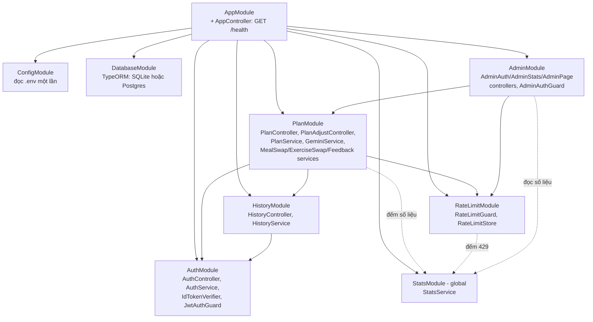

### 5.2 Đường đi của một request

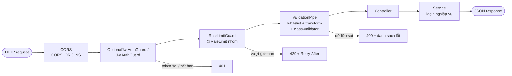

`configureApp()` (`app.setup.ts`) gắn `ValidationPipe({ whitelist: true, transform: true })` — trường lạ bị loại bỏ, chuỗi
số được đổi kiểu — cùng CORS và Swagger. Cả `main.ts` lẫn test e2e đều gọi hàm này, nên test chạy đúng cấu hình thật.

### 5.3 Luồng tạo kế hoạch `POST /api/v1/generate-plan`

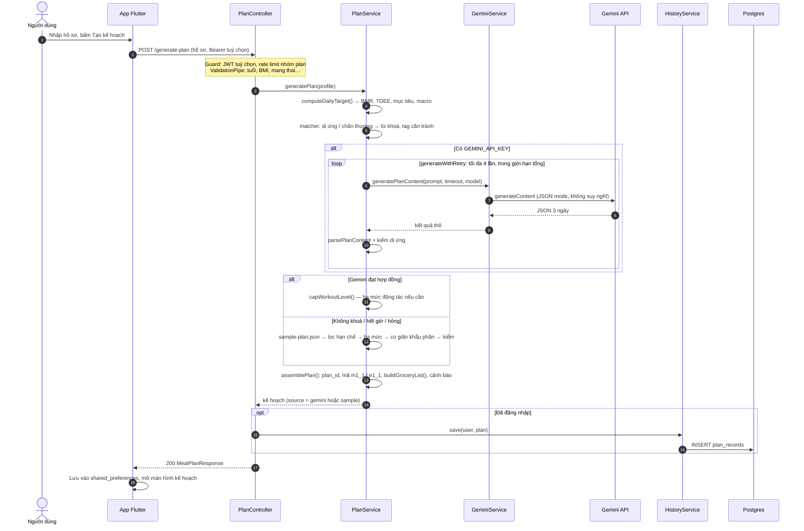

- `source` cho biết kế hoạch từ đâu: `gemini` hay `sample`.
- Lưu lịch sử thất bại **không làm hỏng** request: kế hoạch vẫn trả về, kèm cảnh báo "chưa lưu được vào lịch sử".
- Danh sách đi chợ **luôn tính lại** từ nguyên liệu có cấu trúc (`name`, `amount`, `unit`, `category`), gộp theo nhóm
  `protein` / `produce` / `pantry`, có `source_meal_ids` để biết nguyên liệu dùng cho bữa nào.

### 5.4 Điều chỉnh kế hoạch: nguyên tắc chung

Ba endpoint đổi món, đổi bài, feedback là **không trạng thái**: app gửi `{ profile, plan, … }`, backend trả về **toàn bộ**
kế hoạch mới. Lý do: khách (chưa đăng nhập) cũng dùng được, và backend không phải giữ kế hoạch của khách.

Vì kế hoạch đến từ phía app nên **không được tin**. `readClientPlan()` kiểm trước khi làm gì:

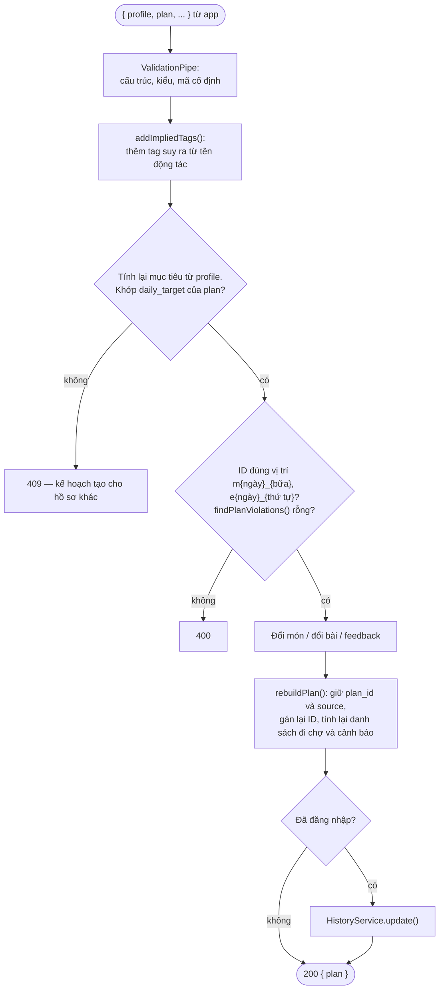

### 5.5 Đổi món `POST /api/v1/meals/swap`

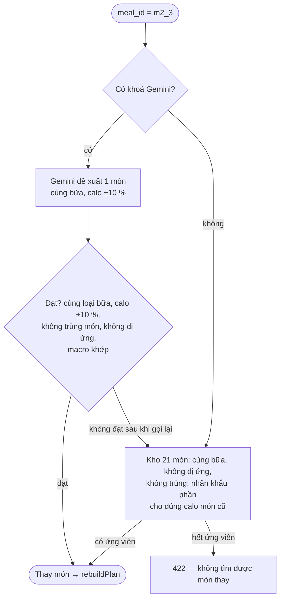

Món trong kho được chọn **ngẫu nhiên** (`RandomSource`, test có thể cố định) để đổi nhiều lần ra món khác nhau.

### 5.6 Đổi bài tập `POST /api/v1/exercises/swap`

"Nhẹ hơn" được định nghĩa đo được bằng code:

- cùng `muscle_group`;
- số hiệp ≤ động tác cũ;
- tập tag mới ⊆ tập tag cũ (không thêm kiểu tải khớp mới);
- không mang tag chấn thương của người dùng;
- mức ≤ mức tối đa của hồ sơ, và (với kho) mức **thấp hơn** động tác cũ — chọn ngẫu nhiên trong nhóm gần mức cũ nhất.

Thứ tự: Gemini trước (chỉ nhận khi đạt mọi điều kiện trên) → kho 41 động tác → `422` nếu động tác đã nhẹ nhất.

### 5.7 Phản hồi cuối ngày `POST /api/v1/feedback`

App hỏi 3 câu: **độ nặng buổi tập** (`easy` / `moderate` / `hard`), **tình trạng cơ thể** (chọn 1–5:
`normal`, `sore`, `joint_pain`, `fatigued`, `danger_sign`), **ăn uống** (`on_plan` / `over` / `under`).

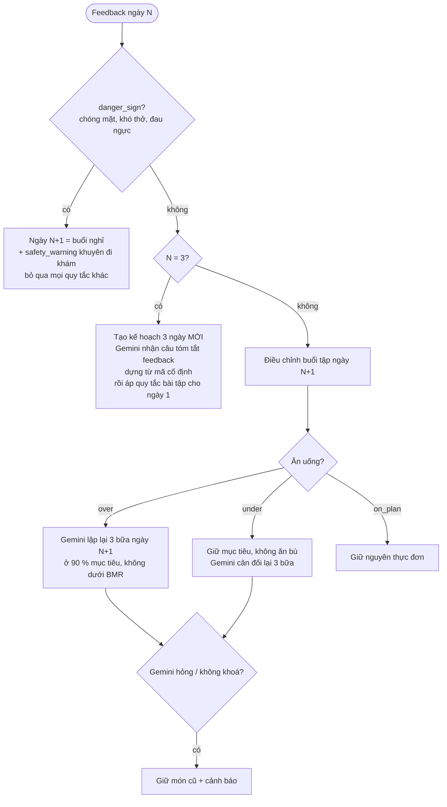

**Quy tắc bài tập** (`workout-rules.ts`, không cần Gemini), theo thứ tự ưu tiên:

| Tình trạng | Điều chỉnh buổi tập ngày kế tiếp |
| --- | --- |
| `danger_sign` | Thay cả buổi bằng buổi nghỉ, dừng xét quy tắc khác |
| `joint_pain` | Thay động tác có `jumping` / `kneeling` / `knee_bend` bằng động tác cùng nhóm cơ không tải khớp; không có thì bỏ |
| `hard` hoặc `fatigued` | Mỗi động tác −1 hiệp (tối thiểu 1), thời lượng × 0,75 (tối thiểu 10 phút) |
| `sore` | (nếu chưa giảm vì mệt) −1 hiệp cho nhóm cơ vừa tập; thêm động tác giãn cơ |
| `easy` và mọi thứ bình thường | Mỗi động tác +1 hiệp (tối đa 6) |

Mỗi động tác giảm tối đa 1 hiệp (không cộng dồn); buổi tập rỗng → thêm "Đi bộ tại chỗ".

### 5.8 Lịch sử và tài khoản

- `GET /api/v1/plans/history` → 50 kế hoạch mới nhất của **chính** người dùng (`id`, `created_at`, `target_calories`).
- `GET /api/v1/plans/history/:id` → nguyên văn JSON kế hoạch đã trả; kế hoạch của người khác → **404** (không lộ là có
  tồn tại); ID không phải UUID → 400.
- `DELETE /api/v1/me` → xoá người dùng; khoá ngoại `ON DELETE CASCADE` xoá luôn mọi kế hoạch.
- Lịch sử lưu kế hoạch nhưng bỏ câu cảnh báo mang thai / có bệnh nền (mục 6.5).
- Lịch sử **không lưu hồ sơ** (hồ sơ chứa dữ liệu sức khoẻ) → màn hình chi tiết lịch sử chỉ xem, không đổi món được
  (đổi món cần hồ sơ để tính lại mục tiêu).

### 5.9 Thống kê

`StatsService` (module global) ghi hai loại dữ liệu **ẩn danh**, giữ vĩnh viễn:

1. **Bộ đếm theo ngày** (`usage_daily`): khoá chính `(day, metric)`, `day` tính theo giờ Việt Nam (UTC+7). Mỗi sự kiện
   chỉ là `count + 1` và cộng thời gian xử lý — dữ liệu tăng tối đa vài chục dòng/ngày.

   | Nhóm | Bộ đếm |
   | --- | --- |
   | Tạo kế hoạch | `plan.gemini`, `plan.sample`, `plan.guest`, `plan.signed_in` |
   | Đổi món | `meal_swap.gemini`, `meal_swap.pool`, `meal_swap.none` |
   | Đổi bài | `exercise_swap.gemini`, `exercise_swap.pool`, `exercise_swap.none` |
   | Feedback | `feedback.total`, `feedback.rebalanced`, `feedback.unchanged` |
   | Bị chặn | `rate_limited.plan`, `rate_limited.adjust`, `rate_limited.admin` |
   | Admin | `admin.login.ok`, `admin.login.failed` |

2. **Nhật ký gọi Gemini** (`gemini_calls`): mỗi lần gọi một dòng — tác vụ, model, lần thứ mấy, kết quả, mã HTTP, thời
   gian, thông báo lỗi ngắn của Google. Không ghi prompt, không ghi nội dung trả về.

Lỗi khi ghi thống kê được bắt và bỏ qua — thống kê không bao giờ làm hỏng request của người dùng.

---

## 6. Dữ liệu

### 6.1 Cơ sở dữ liệu

Cùng một schema chạy trên **SQLite** (máy dev, test trong RAM) và **PostgreSQL** (Neon, production). Mỗi DB có bộ
migration riêng (`migrations/` và `migrations/postgres/`), `migrationsRun` thay vì `synchronize`; test
`migrations.spec.ts` báo lỗi kèm câu SQL còn thiếu nếu entity lệch migration.

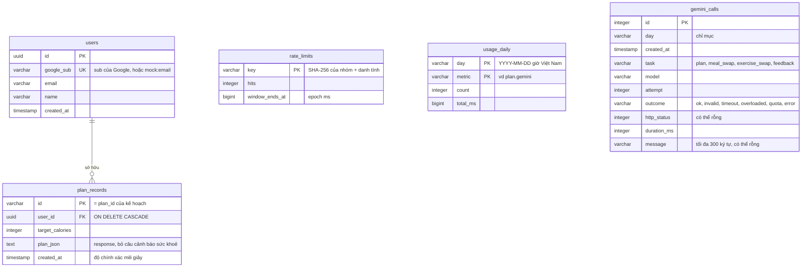

| Migration | Nội dung |
| --- | --- |
| `initial-schema` | `users`, `plan_records` (+ chỉ mục `user_id, created_at`) |
| `rate-limits` | `rate_limits` |
| `usage-stats` | `usage_daily`, `gemini_calls` (+ chỉ mục `day`) |
| `strip-health-warnings` | Chỉ đổi dữ liệu: bỏ câu cảnh báo mang thai / có bệnh nền khỏi các kế hoạch đã lưu trước bản 2.10.1 |

Chú ý: `rate_limits`, `usage_daily`, `gemini_calls` **không có khoá ngoại tới `users`** — thống kê ẩn danh, xoá tài khoản
không làm đổi số liệu và số liệu không truy ngược được về người dùng.

### 6.2 Hợp đồng JSON của kế hoạch (BRD §6)

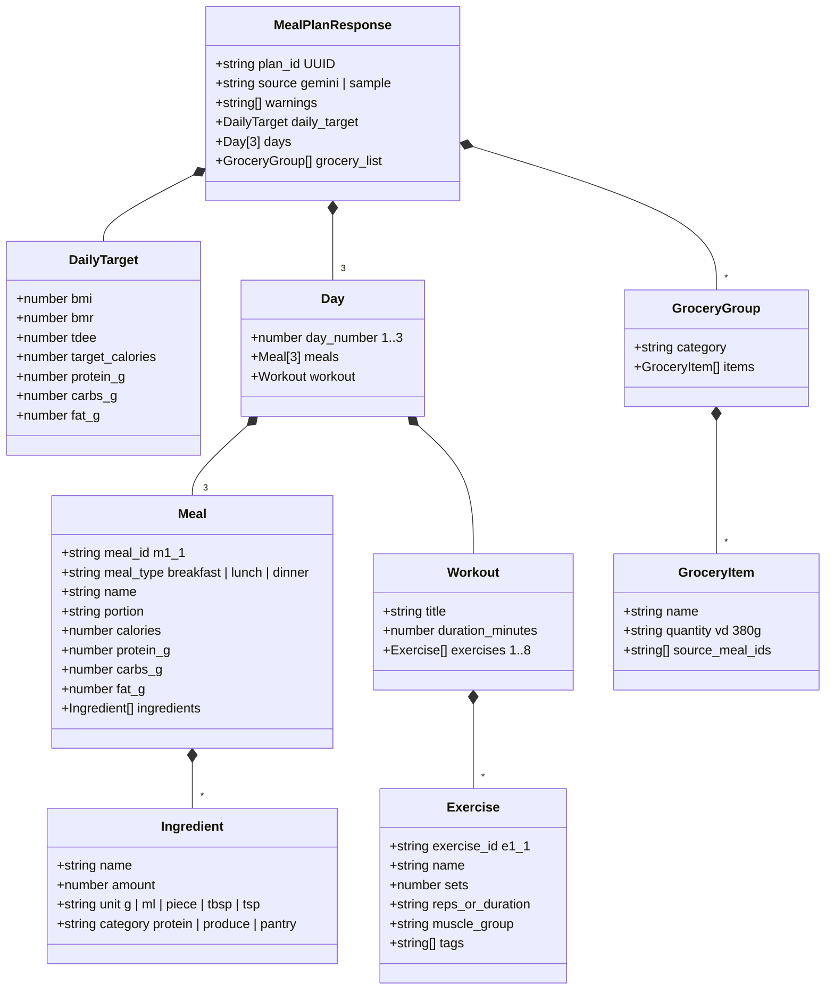

Hồ sơ gửi lên (`CreatePlanDto`):

```json
{
  "age": 22,
  "gender": "female",
  "height_cm": 168,
  "weight_kg": 62,
  "activity_level": "light",
  "goal": "cut",
  "pregnant_or_breastfeeding": false,
  "restrictions": { "allergies": "Hải sản", "injuries": "Đau gối", "health_conditions": "Tiểu đường" }
}
```

**Giữ hợp đồng hai phía khớp nhau:** test `contract-fixtures.e2e-spec.ts` của backend so response thật với các file JSON
trong `frontend_app/test/fixtures/`; test Flutter `contract_test.dart` đọc đúng các file đó và yêu cầu
`fromJson(json).toJson() == json`. Đổi hợp đồng ở một phía → test **cả hai phía** cùng đỏ cho tới khi chạy
`npm run fixtures:update` và sửa model Dart.

### 6.3 Dữ liệu tĩnh đi kèm backend

| File | Nội dung | Kiểm tra lúc khởi động / test |
| --- | --- | --- |
| `sample-plan.json` | Kế hoạch mẫu 3 ngày ~1550 kcal | Đạt mọi luật ở 4.2, tỉ lệ 25/45/30 lệch ≤ 3 điểm |
| `swap-meals.json` | 21 món thay thế | Macro tính lại từ nguyên liệu, lệch ≤ 8 điểm |
| `swap-exercises.json` | 41 động tác, mức 1–3, tag đầy đủ | Mọi động tác trong kế hoạch mẫu phải có trong kho |
| `restriction-keywords.json` | 16 nhóm dị ứng, 5 nhóm chấn thương, từ "không có", từ khoá tên → tag | Nhãn chip trên app phải là nhãn backend hiểu |

`nest-cli.json` copy các file này vào `dist/` khi build; trên Vercel chúng được tham chiếu tĩnh để bundler đóng gói.

### 6.4 Dữ liệu lưu trên thiết bị (app)

| Khoá `shared_preferences` | Nội dung |
| --- | --- |
| `smartfit.profile.v1` | Hồ sơ của kế hoạch hiện tại |
| `smartfit.plan.v1` | Kế hoạch hiện tại (JSON nguyên văn) |
| `smartfit.plan_schedule.v1` | Ngày bắt đầu kế hoạch → biết hôm nay là ngày mấy |
| `smartfit.profile_draft.v1` | Bản nháp hồ sơ đang sửa ở tab Hồ sơ |
| `smartfit.grocery.v1` | Đã mua / đã có, theo từng kế hoạch |
| `smartfit.feedback.v1` | `{plan_id, days}` — ngày nào đã gửi feedback (**không** lưu câu trả lời) |
| `smartfit.access_token` | JWT |
| `smartfit.user.v1` | id, email, tên người dùng |
| `smartfit.welcome_done.v1` | Đã qua màn hình chào |

Android loại `sharedpref` khỏi sao lưu đám mây và chuyển máy (`dataExtractionRules`, `fullBackupContent`) vì có dữ liệu
sức khoẻ và token.

### 6.5 Dữ liệu nằm ở đâu

Dữ liệu của người dùng có thể đi qua 5 chỗ:

1. **Máy người dùng**: `shared_preferences`, mục 6.4.
2. **Backend lúc xử lý request**: chỉ nằm trong RAM, trả kết quả xong là bỏ.
3. **Gemini (Google)**: chỉ nhận phần cần để lập hoặc sửa kế hoạch.
4. **DB server (Neon)**: chỉ lưu một số thứ, phần lớn là khi người dùng đã đăng nhập.
5. **Nhật ký (log)**: log của backend chỉ ghi thông báo lỗi; Vercel tự ghi log truy cập.

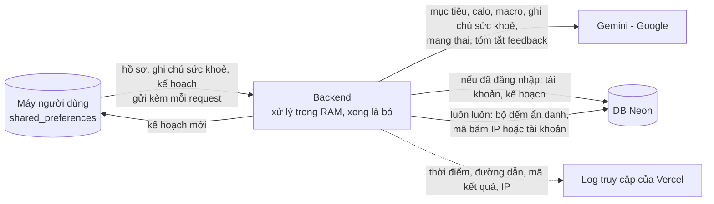

| Dữ liệu | Máy người dùng | Backend nhận | Gửi cho Gemini | DB server | Log |
| --- | --- | --- | --- | --- | --- |
| Tuổi, giới tính, chiều cao, cân nặng, mức vận động | ✅ | ✅ mỗi request | ❌ | ❌ | ❌ |
| Mục tiêu và chỉ số tính từ hồ sơ (BMI, BMR, TDEE, calo, macro) | ✅ | ✅ backend tự tính | ✅ mục tiêu, calo, macro | ✅ trong `plan_json`, nếu đã đăng nhập | ❌ |
| Ghi chú dị ứng, chấn thương, bệnh nền (chữ tự gõ) | ✅ | ✅ | ✅ đã làm sạch, trong khối `<du_lieu_nguoi_dung>` | ❌ | ❌ |
| Mang thai / cho con bú | ✅ | ✅ | ✅ | ❌ (kể cả câu cảnh báo — lưu ý 1) | ❌ |
| Kế hoạch (món, bài tập, danh sách đi chợ) | ✅ | ✅ gửi lại khi đổi món, đổi bài, feedback | Một phần: tên món/động tác cần đổi | ✅ `plan_records`, nếu đã đăng nhập | ❌ |
| Câu trả lời feedback | ❌ chỉ ghi ngày đã gửi | ✅ | Câu tóm tắt dựng từ mã cố định | ❌ câu trả lời — ⚠️ lưu ý 2 | ❌ |
| Email, tên, mã tài khoản Google | ✅ | ✅ lúc đăng nhập (trong ID token) | ❌ | ✅ bảng `users` | ❌ |
| Access token (JWT) | ✅ | ✅ header mỗi request | ❌ | ❌ | ❌ |
| Địa chỉ IP | — | ✅ | ❌ | Chỉ mã băm SHA-256 trong `rate_limits`, tự dọn sau khi hết hạn | ✅ log truy cập của Vercel |
| Số lần dùng, nhật ký gọi Gemini | — | — | ❌ | ✅ ẩn danh, giữ lâu dài | — |

**Lưu ý 1 — câu cảnh báo trong kế hoạch đã lưu.** Response trả cho app có các câu cảnh báo như "Bạn đang mang thai hoặc
cho con bú…" và "Bạn có khai báo tình trạng sức khoẻ…". Câu cảnh báo không chép lại chữ người dùng gõ, nhưng sự có mặt
của hai câu này vẫn cho biết người dùng đang mang thai hay có bệnh nền. Vì vậy:

- `HistoryService` bỏ hai câu này (`HEALTH_STATUS_WARNINGS` trong `plan-warnings.ts`) mỗi khi lưu hoặc cập nhật lịch sử.
  App vẫn nhận đủ cảnh báo trong response.
- Kế hoạch đã lưu trước bản 2.10.1 (khi lịch sử còn giữ nguyên văn response) được dọn bằng migration
  `strip-health-warnings`, chạy trên cả SQLite và Postgres.
- Phần còn suy ra gián tiếp được: thực đơn đã lọc dị ứng (ví dụ không có hải sản), và câu cảnh báo "chế độ mẫu chưa
  nhận ra" cho biết người dùng có nhập dị ứng hoặc chấn thương — nhưng không biết là gì.

**Lưu ý 2 — kết quả feedback nằm trong kế hoạch đã lưu.** Câu trả lời feedback không được lưu, nhưng kế hoạch đã điều
chỉnh thì có lưu (khi đã đăng nhập). Ví dụ ngày kế tiếp bị thay bằng buổi nghỉ cho thấy người dùng đã báo dấu hiệu nguy
hiểm.

Khách (chưa đăng nhập): server không lưu gì gắn với người dùng. Chỉ còn bộ đếm ẩn danh và mã băm IP trong
`rate_limits`. Người dùng đã đăng nhập xoá tài khoản thì bảng `users` và mọi kế hoạch bị xoá theo (`ON DELETE CASCADE`).

---

## 7. Tài liệu API

Gốc: `https://smartfit-api.vercel.app` (máy dev: `http://localhost:3000`). Mọi body là JSON UTF-8.

### 7.1 Danh sách endpoint

| Phương thức | Đường dẫn | Đăng nhập | Giới hạn | Chức năng |
| --- | --- | --- | --- | --- |
| GET | `/health` | — | — | Trạng thái, Gemini có khoá chưa, chế độ đăng nhập |
| POST | `/api/v1/auth/google` | — | — | Đổi Google ID token lấy JWT |
| DELETE | `/api/v1/me` | bắt buộc | — | Xoá tài khoản và lịch sử |
| POST | `/api/v1/generate-plan` | tuỳ chọn | `plan` 5/10m | Tạo kế hoạch 3 ngày |
| POST | `/api/v1/meals/swap` | tuỳ chọn | `adjust` 30/10m | Đổi một món |
| POST | `/api/v1/exercises/swap` | tuỳ chọn | `adjust` | Đổi một động tác |
| POST | `/api/v1/feedback` | tuỳ chọn | `adjust` | Phản hồi cuối ngày |
| GET | `/api/v1/plans/history` | bắt buộc | — | 50 kế hoạch gần nhất |
| GET | `/api/v1/plans/history/:id` | bắt buộc | — | Một kế hoạch |
| POST | `/api/v1/admin/login` | — | `admin` 5/15m | Đăng nhập Admin |
| GET | `/api/v1/admin/session` | Admin | — | Kiểm phiên Admin |
| GET | `/api/v1/admin/stats/overview` | Admin | — | Hôm nay, cấu hình Gemini, số tài khoản |
| GET | `/api/v1/admin/stats/months` | Admin | — | Tổng hợp từng tháng |
| GET | `/api/v1/admin/stats/months/:month` | Admin | — | Chi tiết từng ngày của tháng `YYYY-MM` |
| GET | `/api/v1/admin/stats/gemini-calls` | Admin | — | Nhật ký gọi Gemini, phân trang, lọc theo kết quả |
| GET | `/admin`, `/admin/app.js`, `/admin/app.css` | — | — | Trang thống kê |
| GET | `/docs`, `/docs-json` | — | — | Swagger UI, OpenAPI JSON |

"Tuỳ chọn" = không gửi `Authorization` thì là khách; gửi token sai → 401.

### 7.2 Mã lỗi

| Mã | Khi nào | Ví dụ `message` |
| --- | --- | --- |
| 400 | Dữ liệu sai kiểu/ngưỡng, kế hoạch gửi lên vi phạm luật | `["age must not be less than 18", …]` |
| 401 | Thiếu/sai/hết hạn token, tài khoản đã xoá | "Cần đăng nhập (header Authorization: Bearer <access_token>)." |
| 404 | Kế hoạch không thuộc về bạn; trang Admin chưa bật | "Không tìm thấy kế hoạch này trong lịch sử của bạn." |
| 409 | Hồ sơ không khớp mục tiêu calo của kế hoạch | "Kế hoạch này được tạo cho hồ sơ khác…" |
| 422 | Không tìm được món/động tác thay thế | "Không tìm được động tác nhẹ hơn cùng nhóm cơ…" |
| 429 | Vượt giới hạn tần suất (kèm `Retry-After` giây) | "Bạn thao tác quá nhanh. Vui lòng thử lại sau 10 phút." |
| 500 | Lỗi không lường trước | — |

Mọi thông báo lỗi nghiệp vụ là **tiếng Việt**, app hiển thị nguyên văn.

### 7.3 Ví dụ từng nhóm

**Kiểm tra sức khoẻ**

```http
GET /health
→ 200 { "status": "ok", "gemini": "configured", "auth_mode": "google" }
```

`gemini: "fallback"` nghĩa là chưa có khoá (sẽ dùng thực đơn mẫu). App đọc `auth_mode` để chọn hiện nút Google hay ô
email giả lập.

**Đăng nhập**

```http
POST /api/v1/auth/google
{ "id_token": "<Google ID token>" }          # chế độ mock: "mock:sv@vku.edu.vn"
→ 200 { "access_token": "eyJ…", "user": { "id": "…", "email": "sv@vku.edu.vn", "name": "sv" } }
```

**Tạo kế hoạch**

```http
POST /api/v1/generate-plan
Authorization: Bearer eyJ…        # tuỳ chọn
{ …hồ sơ như mục 6.2… }
→ 200 { "plan_id": "…", "source": "gemini", "warnings": [ … ], "daily_target": { … }, "days": [ … ], "grocery_list": [ … ] }
```

**Đổi món / đổi bài**

```http
POST /api/v1/meals/swap
{ "profile": { … }, "plan": { …kế hoạch hiện tại… }, "meal_id": "m2_3" }
→ 200 { "plan": { …kế hoạch mới, cùng plan_id… } }

POST /api/v1/exercises/swap
{ "profile": { … }, "plan": { … }, "exercise_id": "e1_3" }
→ 200 { "plan": { … } }
```

`meal_id` khớp `^m[1-3]_[1-3]$`, `exercise_id` khớp `^e[1-3]_[1-8]$`.

**Feedback**

```http
POST /api/v1/feedback
{ "profile": { … }, "plan": { … }, "day_number": 1,
  "intensity": "hard", "body_states": ["sore", "fatigued"], "eating": "over" }
→ 200 { "plan": { … }, "safety_warning": null }
# body_states có "danger_sign" → safety_warning: { "message": "…" } và ngày kế tiếp là buổi nghỉ
# day_number = 3 → plan là kế hoạch 3 ngày mới (plan_id mới)
```

**Lịch sử**

```http
GET /api/v1/plans/history           → 200 { "plans": [ { "id": "…", "created_at": "…", "target_calories": 1624 } ] }
GET /api/v1/plans/history/<uuid>    → 200 { …kế hoạch nguyên văn… }
DELETE /api/v1/me                   → 204
```

**Admin**

```http
POST /api/v1/admin/login  { "username": "…", "password": "…" }
→ 200 { "access_token": "…", "expires_in": 28800 }

GET /api/v1/admin/stats/overview
→ { "today": "2026-10-03", "gemini": { "configured": true, "primary_model": "gemini-3.5-flash",
     "fallback_model": "gemini-3.6-flash", "per_call_timeout_ms": …, "total_timeout_ms": …,
     "daily_limit_per_model": 20 },
    "gemini_today": [ { "model": "gemini-3.5-flash", "calls": 3, "ok": 3 } ],
    "accounts": …, "saved_plans": …, "rate_limits": { "plan": "5/10m", "adjust": "30/10m", "admin": "5/15m" } }

GET /api/v1/admin/stats/months            → [ { "month": "2026-10", "usage": { "plan.gemini": { "count": 2, "total_ms": 28400 } }, "gemini": [ … ] } ]
GET /api/v1/admin/stats/months/2026-10    → { "month": "2026-10", "days": [ { "day": "2026-10-03", "usage": { … }, "gemini": [ … ] } ] }
GET /api/v1/admin/stats/gemini-calls?month=2026-10&outcome=overloaded&page=1
→ { "month": "2026-10", "page": 1, "page_size": …, "total": …, "calls": [ { "created_at": "…", "task": "plan",
     "model": "…", "attempt": 1, "outcome": "overloaded", "http_status": 503, "duration_ms": 20150, "message": "…" } ] }
```

### 7.4 Đăng nhập Google từ đầu tới cuối

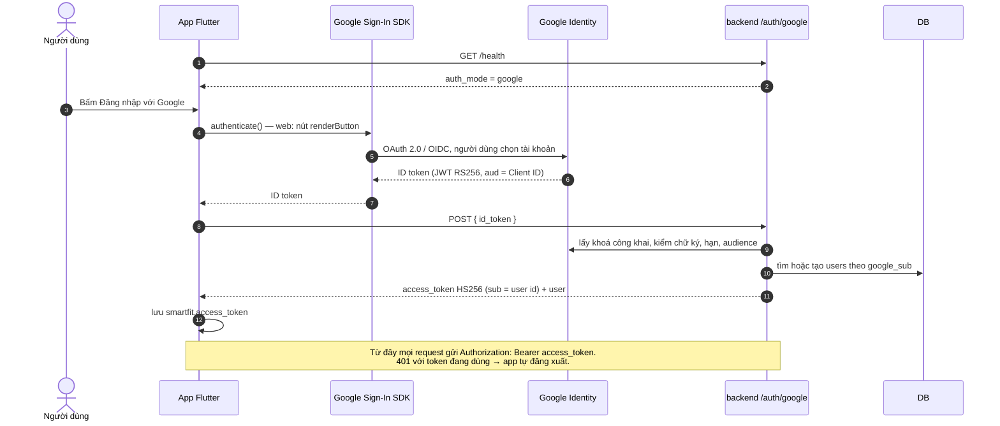

---

## 8. Swagger API — tài liệu API thử trực tiếp

Swagger (chuẩn **OpenAPI 3**) là tài liệu API **sinh tự động từ chính mã nguồn**: decorator `@ApiProperty`,
`@ApiOperation`, `@ApiResponse` trên DTO và controller. Không có file tài liệu viết tay nào có thể lệch với code.

### 8.1 Địa chỉ

| | Production | Máy dev |
| --- | --- | --- |
| Swagger UI | https://smartfit-api.vercel.app/docs | http://localhost:3000/docs |
| OpenAPI JSON | https://smartfit-api.vercel.app/docs-json | http://localhost:3000/docs-json |

### 8.2 Cách hoạt động

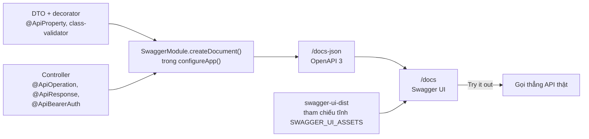

Trên Vercel, file JS/CSS của Swagger UI được tham chiếu tĩnh (`SWAGGER_UI_ASSETS` trong `app.setup.ts`) để bundler đóng
gói — không làm vậy thì `/docs` trả 404 trên serverless.

### 8.3 Dùng Swagger UI từng bước

1. Mở `/docs`. Các endpoint chia nhóm theo tag; mỗi endpoint có mô tả tiếng Việt, ví dụ request, các mã lỗi có thể gặp.
2. Mở một endpoint → **Try it out** → sửa body mẫu → **Execute**. Swagger hiện lệnh `curl` tương đương, mã trạng thái, body
   và header trả về.
3. **Gọi endpoint cần đăng nhập:**
   - Máy dev (`AUTH_MODE=mock`): gọi `POST /api/v1/auth/google` với `{ "id_token": "mock:ban@vku.edu.vn" }`, chép
     `access_token`.
   - Production: lấy token từ app (đăng nhập Google) — production không nhận `mock:`.
   - Bấm **Authorize** (góc phải), dán token (không gõ chữ `Bearer`), **Authorize**. Từ đó mọi request gửi kèm header.
4. **Endpoint Admin:** gọi `POST /api/v1/admin/login`, dán `access_token` nhận được vào Authorize. Token Admin và token
   người dùng tách biệt: dán nhầm loại sẽ nhận 401.
5. **Thử đổi món:** chạy `generate-plan`, chép **toàn bộ** response làm giá trị `plan`, chép hồ sơ đã dùng làm `profile`,
   thêm `"meal_id": "m1_2"`. Sửa hồ sơ (ví dụ đổi cân nặng) sẽ nhận 409 — đúng thiết kế.

### 8.4 Gọi API không qua Swagger

```bash
# Sức khoẻ
curl https://smartfit-api.vercel.app/health

# Tạo kế hoạch với tư cách khách (máy dev)
curl -X POST http://localhost:3000/api/v1/generate-plan \
  -H 'Content-Type: application/json' \
  -d '{"age":22,"gender":"female","height_cm":168,"weight_kg":62,"activity_level":"light","goal":"cut"}'

# Đăng nhập giả lập rồi xem lịch sử (máy dev)
TOKEN=$(curl -s -X POST http://localhost:3000/api/v1/auth/google \
  -H 'Content-Type: application/json' -d '{"id_token":"mock:sv@vku.edu.vn"}' | jq -r .access_token)
curl -H "Authorization: Bearer $TOKEN" http://localhost:3000/api/v1/plans/history
```

File `/docs-json` nhập được vào Postman, Insomnia hay công cụ sinh client (OpenAPI Generator).

---

## 9. Frontend `frontend_app/`

### 9.1 Kiến trúc lớp

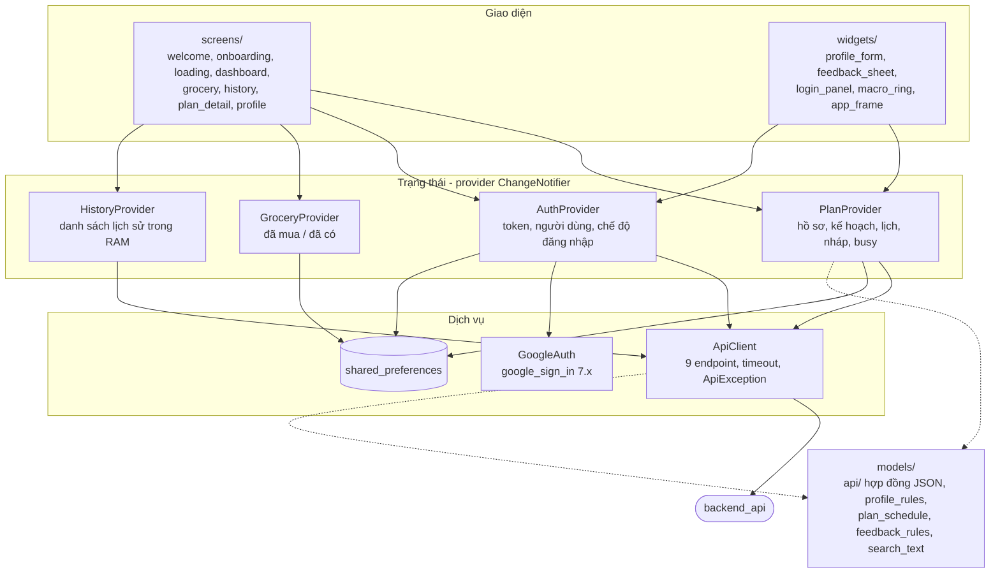

**Quy tắc:** màn hình chỉ đọc/ghi qua provider, không bao giờ gọi `ApiClient` hay `http` trực tiếp; lỗi hiển thị
`ApiException.message` (tiếng Việt).

### 9.2 Điều hướng màn hình

Không dùng thư viện router: `MainShell` giữ một `enum AppScreen { onboarding, loading, home }` cộng màn hình chào lần đầu.

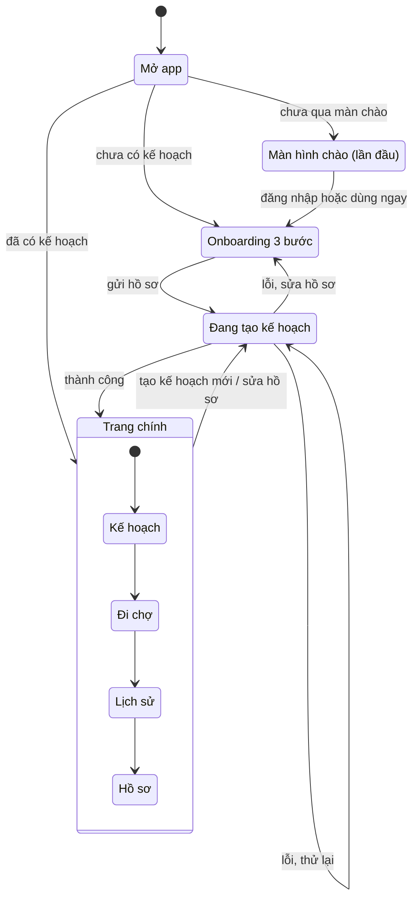

Khi app quay lại từ nền, `MainShell` vẽ lại để "hôm nay là ngày mấy" luôn theo lịch thật (`plan_schedule.dart`).

### 9.3 Các provider

| Provider | Giữ gì | Điểm đáng chú ý |
| --- | --- | --- |
| `PlanProvider` | Hồ sơ của kế hoạch, kế hoạch, ngày bắt đầu, nháp hồ sơ, các ngày đã feedback | Sửa ở tab Hồ sơ chỉ là **nháp** → đổi món vẫn gửi đúng hồ sơ của kế hoạch, không bị 409. Đang `busy` thì bỏ qua lệnh mới. Hồ sơ lưu cũ vi phạm luật mới → bỏ kế hoạch |
| `AuthProvider` | Token, người dùng, đã qua màn chào | Nhận 401 → tự đăng xuất; `loginMode()` đọc `/health` |
| `GroceryProvider` | Đã mua / đã có | Khoá theo kế hoạch + nhóm + tên + lượng |
| `HistoryProvider` | Danh sách lịch sử | Chỉ trong RAM, xoá khi đăng xuất / đổi tài khoản |

### 9.4 Gọi API và xử lý lỗi

`ApiClient`:

- Timeout **60 s** cho các lệnh có thể gọi Gemini (backend tự dừng trước đó), **15 s** cho lệnh khác.
- Giải mã body bằng UTF-8 từ `bodyBytes` (tránh lỗi font tiếng Việt).
- Không bao giờ ghi log body (có dữ liệu sức khoẻ).
- Mọi lỗi thành một lớp con của `sealed class ApiException`:

| Lớp | Nguồn | Ví dụ hiển thị |
| --- | --- | --- |
| `NetworkException` | Mất mạng, không tới được server | "Không kết nối được máy chủ. Kiểm tra mạng rồi thử lại." |
| `ApiTimeoutException` | Quá thời gian chờ | "Máy chủ phản hồi quá lâu. Vui lòng thử lại sau ít phút." |
| `ValidationException` | 400 | "Thông tin gửi lên chưa hợp lệ…" (chi tiết tiếng Anh giữ riêng để debug) |
| `UnauthorizedException` | 401 | "Phiên đăng nhập đã hết hạn…" — token đang dùng thì gọi `onUnauthorized` → đăng xuất |
| `NotFoundException` | 404 | "Không tìm thấy kế hoạch này." |
| `PlanOutdatedException` | 409 | Câu của server, mặc định "Kế hoạch này không còn khớp với hồ sơ…" |
| `NoReplacementException` | 422 | Câu của server, mặc định "Chưa tìm được lựa chọn thay thế phù hợp." |
| `TooManyRequestsException` | 429 | Câu của server có thời gian chờ |
| `ServerException` | 5xx | "Máy chủ đang gặp sự cố. Vui lòng thử lại sau." |

Model JSON (`lib/models/api/`) viết tay, đọc số dạng `num` để `fromJson(json).toJson()` trả **đúng từng con số** —
backend kiểm từng ID và con số khi đổi món. Thiếu trường, sai kiểu, mã lạ → `FormatException` nêu tên trường.

### 9.5 Giữ dữ liệu đang nhập

Dữ liệu đang nhập dở (form hồ sơ, email đăng nhập, sheet đang mở) **không** ghi vào `shared_preferences`, mà dùng
**state restoration** của Flutter (`RestorationMixin`, `RestorableRouteFuture`): hệ điều hành tắt app ngầm thì mở lại
còn nguyên; người dùng tự đóng hẳn app thì xoá — đúng kỳ vọng và không để dữ liệu sức khoẻ nằm lại.

### 9.6 Đa nền tảng

| Nền tảng | Trạng thái | Ghi chú |
| --- | --- | --- |
| Android | APK build với `API_BASE_URL` của backend thật, đã đăng nhập Google thật trên máy ảo Android 16 | `compileSdk 36`, HTTP thường chỉ cho bản debug |
| Web | Chạy thật trên GitHub Pages, đăng nhập Google | Cần CORS của backend |
| Windows | CI build được | Không có plugin Google Sign-In → chỉ dùng chế độ khách / giả lập |
| macOS | CI build (không ký) | Đăng nhập Google cần team ký app |
| iOS | Tạm dừng (quyết định D7) | |

`AppFrame` giữ nội dung trong cột rộng tối đa 640 px trên web/desktop cho giống giao diện điện thoại.

---

## 10. Cách vận hành app (hướng dẫn người dùng)

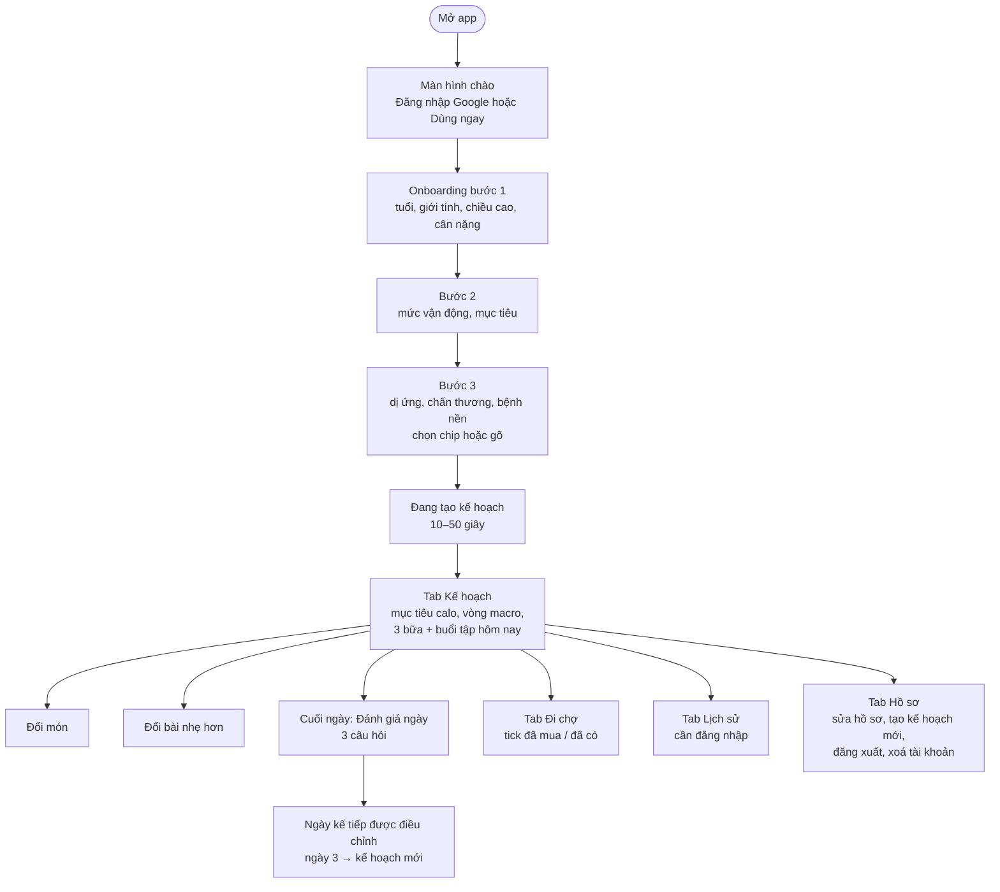

**Các bước chi tiết**

1. **Mở app lần đầu** → màn hình chào. Chọn đăng nhập Google (kế hoạch được lưu vào tài khoản, xem được trên máy
   khác) hoặc *Dùng ngay* (kế hoạch chỉ nằm trên máy; đăng nhập sau cũng được).
2. **Onboarding 3 bước.** App khoá trước các lựa chọn không an toàn (ví dụ không cho chọn *Giảm cân* khi BMI < 18,5 hay
   khi đang mang thai), cùng ngưỡng với backend.
3. **Chờ tạo kế hoạch.** Thường 10–20 giây nếu Gemini chạy, có thể tới ~50 giây khi Gemini chậm. Nếu Gemini lỗi, app vẫn
   nhận kế hoạch từ thực đơn mẫu kèm dòng cảnh báo.
4. **Tab Kế hoạch** hiện ngày hôm nay (ngày 1, 2, 3 theo lịch), mục tiêu calo và macro, 3 bữa, buổi tập. Chuyển ngày để
   xem trước.
   - **Đổi món:** bấm nút đổi ở một bữa → món khác cùng bữa, calo gần bằng.
   - **Đổi bài:** bấm ở một động tác → động tác nhẹ hơn cùng nhóm cơ. Động tác nhẹ nhất rồi thì app báo không đổi được.
5. **Đánh giá cuối ngày** (mở được cho hôm nay, hôm qua, và ngày 3 sau khi kế hoạch kết thúc): trả lời 3 câu. Chọn
   *chóng mặt / khó thở / đau ngực* thì app hiện lời khuyên ngay và chỉ đóng khi bấm *Tôi đã hiểu*. Sau khi gửi, app
   tóm tắt những gì đã thay đổi.
6. **Tab Đi chợ:** nguyên liệu 3 ngày gộp theo nhóm *Đạm*, *Rau củ quả*, *Gạo, bún & gia vị*. Đánh dấu *đã mua* hoặc *nhà đã có*.
7. **Tab Lịch sử** (cần đăng nhập): các kế hoạch cũ, bấm để xem lại (chỉ xem).
8. **Tab Hồ sơ:** sửa hồ sơ rồi tạo kế hoạch mới; đăng xuất; xoá tài khoản (hỏi xác nhận, xoá luôn lịch sử trên server).
   Khách tạo kế hoạch mới sẽ được hỏi trước, vì kế hoạch cũ sẽ mất hẳn.
9. **Thao tác quá nhanh** (quá 5 lần tạo kế hoạch trong 10 phút) → app báo thời gian cần chờ.

**Cài đặt**

| Nền tảng | Cách dùng |
| --- | --- |
| Web | Mở https://alenjason.github.io/AI-Product-Development-End-to-End/ |
| Android | Cài APK build với `--dart-define=API_BASE_URL=https://smartfit-api.vercel.app` và `GOOGLE_WEB_CLIENT_ID` (APK do CI build trỏ về `localhost`, chỉ dùng để kiểm build) |
| Windows / macOS | Build với cùng `API_BASE_URL`, dùng như khách (chưa đăng nhập Google được) |

**Chạy toàn bộ trên máy dev (không cần khoá nào)**

```bash
cd backend_api && npm install && cp .env.example .env && npm run start:dev   # http://localhost:3000, /docs
cd frontend_app && flutter pub get && flutter run -d chrome                 # app tự trỏ về localhost:3000
```

---

## 11. Trang thống kê Admin

Trang `/admin` dành cho người vận hành: **chỉ thống kê**, không quản lý người dùng, không xem được kế hoạch hay dữ liệu
sức khoẻ của ai.

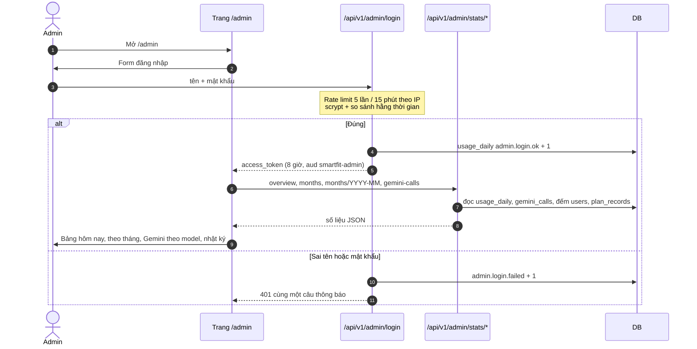

**Trang hiển thị**

- **Hôm nay:** model chính/dự phòng, số lượt đã dùng / 20 của từng model, số tài khoản, số kế hoạch đã lưu, giới hạn tần
  suất đang áp dụng.
- **Theo tháng:** số kế hoạch Gemini / mẫu, khách / đã đăng nhập, đổi món, đổi bài, feedback, số lần bị chặn, thời gian xử
  lý trung bình; bấm một tháng để xem từng ngày.
- **Gemini theo model và kết quả:** số lần `ok`, `invalid`, `timeout`, `overloaded`, `quota`, `error` và thời gian trung
  bình.
- **Nhật ký Gemini:** từng lần gọi, lọc theo kết quả, phân trang.

**Bảo vệ trang:** CSP chặt (`default-src 'none'; script-src 'self'; …`), dữ liệu đưa vào DOM chỉ qua `textContent` (không
`innerHTML`) nên không bị XSS; không có tài khoản trong env → mọi route Admin trả 404.

**Bật trang / đổi mật khẩu**

```bash
cd backend_api
npm run build && npm run admin:hash -- --generate   # sinh mật khẩu ngẫu nhiên + mã băm (mật khẩu không rời máy)
# Vercel → Settings → Environment Variables: ADMIN_USERNAME, ADMIN_PASSWORD_HASH → Redeploy
```

---

## 12. Triển khai và CI/CD

### 12.1 Sơ đồ triển khai

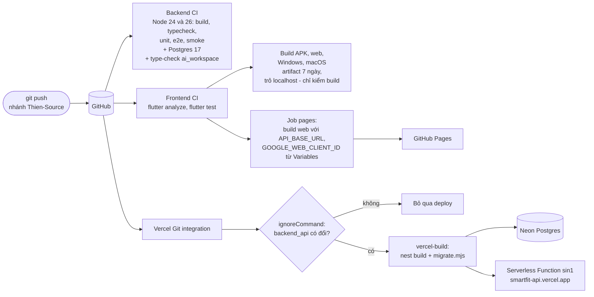

- **Vercel**: root directory `backend_api`, production branch `Thien-Source`. `ignoreCommand` bỏ qua deploy khi commit
  không đụng `backend_api/`. Migration chạy **một lần lúc build**, không phải lúc mỗi function khởi động.
- **Neon**: dùng chuỗi kết nối có *pooler* (nhiều function serverless dùng chung ít kết nối).
- **GitHub Pages**: job `pages` build bản web với địa chỉ API và Client ID lấy từ **repo Variables** (không ghi vào mã).

### 12.2 Biến môi trường backend

| Biến | Mặc định | Ý nghĩa |
| --- | --- | --- |
| `PORT` | 3000 | Cổng khi chạy máy |
| `CORS_ORIGINS` | trống | Origin được gọi từ trình duyệt; trống + dev = mọi cổng localhost; trống + production = tắt CORS |
| `GEMINI_API_KEY` | trống | Không có → thực đơn mẫu |
| `GEMINI_MODEL` | `gemini-3.5-flash` | Model chính |
| `GEMINI_FALLBACK_MODEL` | `gemini-3.6-flash` | Model dự phòng; `off` = tắt |
| `GEMINI_THINKING` | `off` | `off` / `low` / `default` |
| `GEMINI_TIMEOUT_MS` | 20000 | Mỗi lần gọi (production đặt 45000) |
| `GEMINI_TOTAL_TIMEOUT_MS` | 40000 | Cả chuỗi gọi lại (production đặt 50000) |
| `GEMINI_BASE_URL` | trống | Chỉ cho test (server Gemini giả) |
| `DATABASE_PATH` | `database.sqlite` | SQLite khi phát triển |
| `DATABASE_URL` | trống | Có → dùng Postgres |
| `DATABASE_RUN_MIGRATIONS` | trống | `false` → không migrate lúc khởi động |
| `AUTH_MODE` | `mock` | `mock` / `google` |
| `GOOGLE_CLIENT_ID` | trống | Bắt buộc khi `google`; nhiều ID cách dấu phẩy |
| `JWT_SECRET` | trống | Bắt buộc khi `google`, ≥ 32 ký tự |
| `JWT_EXPIRES_IN` | `7d` | |
| `ALLOW_MOCK_AUTH` | trống | Cho phép mock trên production (chỉ bản demo) |
| `RATE_LIMIT_PLAN` / `_ADJUST` / `_ADMIN` | 5/10m, 30/10m, 5/15m | `<số lần>/<số><đơn vị>` (đơn vị `s`, `m`, `h`, `d`) hoặc `off` |
| `TRUST_PROXY_HOPS` | 0 | 1 trên Vercel |
| `ADMIN_USERNAME`, `ADMIN_PASSWORD_HASH` | trống | Trống cả hai = tắt trang Admin |
| `ADMIN_TOKEN_TTL` | 8h | Tối đa 1d |

Cấu hình sai (thiếu Client ID, JWT_SECRET ngắn, mock trên production, chỉ có nửa tài khoản Admin, `CORS_ORIGINS` sai
dạng…) → backend **không khởi động**, thay vì chạy với cấu hình nguy hiểm.

### 12.3 Thao tác vận hành thường gặp

| Việc | Cách làm |
| --- | --- |
| Deploy backend | Push lên `Thien-Source` có đổi `backend_api/` → Vercel tự build |
| Quay về bản trước | Vercel → Deployments → bản cũ → *Promote to Production* (DB không quay lại, migration chỉ thêm) |
| Đổi biến môi trường | Vercel → Settings → Environment Variables → Redeploy (`.env` chỉ đọc lúc khởi động) |
| Kiểm khoá Gemini đã nhận | `GET /health` → `gemini: "configured"` |
| Xem Gemini có hay lỗi | Trang `/admin` → Nhật ký Gemini |
| Đo tốc độ Gemini thật | `npm run build && npm run measure:gemini` (tốn lượt, không dùng trong test) |
| Thử nghiệm prompt | `ai_workspace/`: `npm run experiment` |

---

## 13. Bảo mật và quyền riêng tư

| Rủi ro | Biện pháp |
| --- | --- |
| Lộ dữ liệu sức khoẻ | Không ghi hồ sơ và ghi chú sức khoẻ vào DB hay log; lịch sử không giữ hồ sơ gốc (kể cả câu cảnh báo mang thai / có bệnh nền — mục 6.5); app không log body; Android không sao lưu `sharedpref` lên đám mây. Ghi chú sức khoẻ có gửi cho Gemini (gói miễn phí, Google có thể đọc), trang chính sách đã nói rõ điều này |
| Lộ bí mật | Khoá Gemini, `DATABASE_URL`, `JWT_SECRET`, mã băm Admin chỉ nằm trong env của Vercel; `.env`, `*.sqlite`, file ghi chú tài khoản Admin nằm trong `.gitignore`; Client ID nằm trong repo Variables |
| Token Google của app khác | Luôn kiểm `audience` |
| Lộ token trong log | Không ghi thông báo lỗi của thư viện Google (có chứa token và email) |
| Tài khoản đã xoá vẫn dùng token | Guard đọc lại người dùng mỗi request |
| Prompt injection | Khối dữ liệu có thẻ, xoá `<` `>`, giới hạn độ dài, kết quả luôn bị kiểm lại; feedback gửi Gemini chỉ dựng từ mã cố định |
| AI trả kết quả nguy hiểm | Kiểm dị ứng, chấn thương, mức khó, ngưỡng calo bằng code; sàn BMR; dấu hiệu nguy hiểm → buổi nghỉ + khuyên đi khám |
| Lạm dụng API, cạn lượt Gemini | Rate limit theo IP / tài khoản; free tier 20 lượt/ngày/model |
| Dò mật khẩu Admin | scrypt, rate limit 5/15 phút, cùng một câu báo lỗi, phiên hết hạn 8 giờ |
| XSS trang Admin | CSP chặt, `textContent` |
| Truy cập lịch sử người khác | Lọc theo `user_id`, trả 404 thay vì 403 |
| CORS | Chỉ origin trong `CORS_ORIGINS` (GitHub Pages) |
| Mock auth bị bật nhầm trên production | Backend từ chối khởi động |

---

## 14. Kiểm thử

### 14.1 Các tầng test

```mermaid
flowchart BT
    unit["Unit test backend - Vitest<br/>456 test: công thức, luật kiểm, matcher,<br/>retry/fallback, rate limit, scrypt, thống kê"]
    e2e["E2E backend - Supertest<br/>108 test: mọi endpoint qua HTTP,<br/>SQLite trong RAM, Gemini giả"]
    pg["Postgres<br/>chạy lại migration, store, thống kê<br/>và toàn bộ e2e trên Postgres 17"]
    smoke["Smoke test<br/>chạy bản build dist/,<br/>cả chế độ handler Vercel"]
    flutter["Flutter - 175 test<br/>widget, provider, model hợp đồng,<br/>backend giả"]
    contract["Hợp đồng chung<br/>fixtures JSON dùng cho cả hai phía"]
    integ["Integration test thủ công<br/>app thật + backend thật trên emulator / macOS"]

    unit --> e2e --> pg --> smoke
    contract --- e2e
    contract --- flutter
    flutter --> integ
```

### 14.2 Kỹ thuật đáng chú ý

- **Không gọi API thật trong test:** `test/fake-gemini-server.ts` là server HTTP nói đúng định dạng `generateContent`; SDK
  thật được trỏ vào nó qua `GEMINI_BASE_URL` → test được cả timeout, 503, 429, JSON hỏng. Google ID token được kiểm bằng
  token tự ký với khoá RSA tạm.
- **`createTestApp()` ghim biến môi trường** trước khi nạp `AppModule` (máy dev có thể có khoá thật trong `.env`) và trả lại
  khi đóng.
- **Smoke test** bắt lỗi chỉ có ở bản build (thiếu file dữ liệu, vòng import ESM giữa entity) mà Vitest chạy `.ts` không
  thấy.
- **Mutation check thủ công:** cố ý làm hỏng từng luật quan trọng (bỏ kiểm `sub` trong token Admin, bỏ kiểm audience,
  bỏ sàn BMR…) và xác nhận có test đỏ — giai đoạn 9 kiểm 11 chỗ, giai đoạn 10 kiểm 35 chỗ, bản 2.10.1 kiểm 5 chỗ.
- **Test restoration:** `tester.restartAndRestore()` kiểm form không mất khi app bị hệ điều hành tắt.

### 14.3 Lệnh

```bash
# backend_api
npm run build && npm run typecheck && npm run lint
npm test                 # unit
npm run test:e2e         # e2e
npm run test:smoke       # sau build
TEST_DATABASE_URL=postgres://… npm run test:postgres

# frontend_app
flutter analyze && flutter test
```

---

## 15. Giới hạn hiện tại và hướng phát triển

| Giới hạn | Ảnh hưởng | Hướng xử lý |
| --- | --- | --- |
| Free tier Gemini: 20 lượt/ngày/model, hay 503 | Nhiều người dùng cùng lúc → nhiều kế hoạch mẫu | Model dự phòng đã giảm bớt; trả phí hoặc thêm model khi cần |
| Gemini chậm (có lúc 28–30 s/plan) | Người dùng chờ lâu | Timeout 45/50 s trên production; có thể chuyển sang tạo nền + thông báo |
| Thực đơn mẫu chỉ lọc theo từ khoá | Dị ứng hiếm có thể không nhận ra | Luôn kèm cảnh báo; mở rộng `restriction-keywords.json` |
| Windows chưa có đăng nhập Google | Chỉ dùng khách / giả lập | Chờ plugin hoặc dùng luồng OAuth trình duyệt |
| macOS cần ký app để đăng nhập Google | | Cần Apple Developer team |
| iOS tạm dừng | | Cấu hình khi có thiết bị và tài khoản |
| Không có thông báo nhắc feedback | Người dùng có thể quên | Local notification |

---

## 16. Phụ lục: thuật ngữ

| Thuật ngữ | Nghĩa |
| --- | --- |
| BMI / BMR / TDEE | Chỉ số khối cơ thể / năng lượng nghỉ / tổng năng lượng tiêu hao một ngày |
| Macro | Ba chất sinh năng lượng: đạm (protein), tinh bột (carbs), béo (fat) |
| DTO | Data Transfer Object — lớp mô tả dữ liệu vào/ra của API |
| Guard / Pipe | Thành phần NestJS chạy trước controller: kiểm quyền / kiểm và đổi kiểu dữ liệu |
| JWT | JSON Web Token — chuỗi ký số chứa thông tin đăng nhập |
| OIDC | OpenID Connect — chuẩn đăng nhập trên nền OAuth 2.0 (Google Sign-In) |
| Serverless Function | Mã chạy theo từng request trên hạ tầng nhà cung cấp, không có server chạy liên tục |
| Migration | Script thay đổi cấu trúc DB có đánh số thứ tự |
| Rate limit | Giới hạn số request trong một khoảng thời gian |
| Fallback | Phương án dự phòng (model dự phòng, thực đơn mẫu) |
| Fixture | Dữ liệu mẫu cố định dùng cho test |
| Swagger / OpenAPI | Chuẩn mô tả REST API và giao diện thử API trên trình duyệt |
| State restoration | Cơ chế Flutter khôi phục trạng thái giao diện sau khi hệ điều hành tắt app ngầm |
