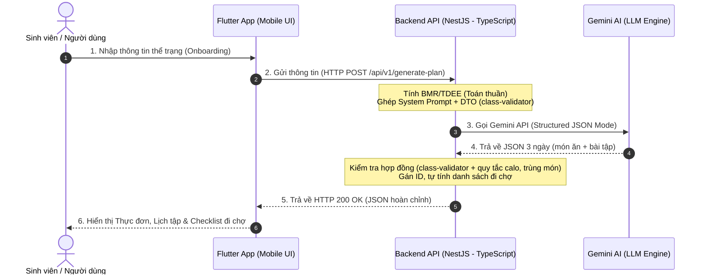
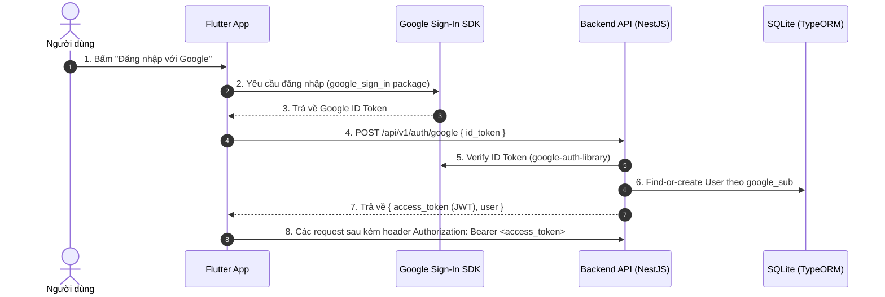

# BUSINESS REQUIREMENTS DOCUMENT (BRD)
## Dự án: SmartFit AI – Adaptive Meal & Workout Planner
**Tên sản phẩm:** Trợ lý AI Gợi ý & Điều chỉnh Thực đơn, Lịch tập Thông minh  
**Môn học:** AI Product Development End-to-End (Đồ án Kỹ sư / Cử nhân Năm 4)  
**Đơn vị thực hiện:** Trường Đại học Công nghệ Thông tin và Truyền thông Việt - Hàn (VKU)  
**Phiên bản:** 2.5.1 (Dành cho Sinh viên thực hành: Flutter & NestJS)  
**Ngày cập nhật:** 24/09/2026  
**Trạng thái:** Đã phê duyệt (Approved)  

---

## 1. TỔNG QUAN DỰ ÁN (EXECUTIVE SUMMARY)

**SmartFit AI** là ứng dụng di động hỗ trợ quản lý sức khỏe cá nhân hóa, giúp tự động tạo và linh hoạt điều chỉnh lịch ăn uống, tập luyện theo nhu cầu và thể trạng thực tế của từng cá nhân. 

Thay vì cung cấp một kế hoạch 30 ngày cứng nhắc (nguyên nhân khiến 80% người mới bỏ cuộc), SmartFit AI tiếp cận theo hướng **tương tác hai chiều thân thiện (Human-in-the-loop & Adaptive Feedback)** với chu kỳ **3 ngày cuốn chiếu (Rolling 3-Day Plan)**:
* **Ăn uống:** Ưu tiên các món ăn gia đình Việt Nam bình dân, gần gũi, dễ mua, dễ nấu.
* **Tập luyện:** Bài tập thể dục tại nhà (Bodyweight/Calisthenics), không cần tạ hay dụng cụ đắt tiền.
* **Tiện ích:** Danh sách đi chợ thông minh (Checklist) gom nguyên liệu giúp sinh viên và người bận rộn mua sắm nhanh gọn.

> [!NOTE]
> **Định vị kỹ thuật của đồ án:** Dự án được thiết kế chuẩn chỉnh theo mô hình phát triển sản phẩm AI End-to-End nhưng được **tối ưu hóa cho sinh viên năm 4 mới tiếp cận Flutter và REST API**. Kiến trúc tinh gọn, dễ debug, dễ kiểm thử bằng giao diện Swagger UI trước khi tích hợp vào ứng dụng di động.

---

## 2. BÀI TOÁN & GIẢI PHÁP (PROBLEM & SOLUTION)

### 2.1. Vấn đề thực tế
1. **Thực đơn ngoại nhập khó áp dụng:** Các app quốc tế thường gợi ý yến mạch, măng tây, ức gà áp chảo, cá hồi... vừa đắt vừa khó duy trì với người Việt Nam.
2. **Kế hoạch quá dài hạn:** Kế hoạch 1 tháng dễ bị "vỡ trận" ngay tuần đầu khi có tiệc tùng, bận thi cử hoặc một ngày mệt mỏi.
3. **Không biết cách thay thế:** Khi hết nguyên liệu trong tủ lạnh hoặc đau cơ bắp, người dùng không biết chọn món nào hoặc bài tập nào tương đương để thay thế.
4. **Bối rối khi đi chợ:** Khó tính toán khối lượng thịt, rau cần mua cho 3 ngày tới, dẫn tới lãng phí thực phẩm.

### 2.2. Giải pháp của SmartFit AI
* **Khảo sát đơn giản & cá nhân:** Nhập chiều cao, cân nặng, mục tiêu, hạn chế (dị ứng, chấn thương) và tình trạng sức khoẻ bằng lời của chính người dùng.
* **Kế hoạch 3 ngày thực tế:** Tạo thực đơn món Việt và bài tập tại nhà 15–25 phút.
* **Đổi món & đổi bài tập thông minh (Interactive Swap):** Đổi ngay món hoặc bài tập khác tương đương lượng Calo/Macro chỉ bằng một chạm.
* **Ghi nhận phản hồi cuối ngày (Adaptive Feedback):** Báo mệt mỏi hoặc lỡ ăn nhiều để AI tự hạ cường độ hoặc cân bằng calo ngày hôm sau.
* **Danh sách đi chợ (Smart Checklist):** Tự động bóc tách nguyên liệu thành danh sách tích chọn đi chợ tiện lợi.

---

## 3. ĐỐI TƯỢNG NGƯỜI DÙNG MỤC TIÊU

1. **Sinh viên & Người mới đi làm:** Cần thực đơn tiết kiệm, bài tập nhanh tại phòng trọ/nhà ở không cần dụng cụ.
2. **Dân văn phòng bận rộn:** Cần ăn uống linh hoạt theo bữa cơm gia đình hoặc cơm văn phòng, có thể đổi món tức thì khi có lịch liên hoan đột xuất.
3. **Người có hạn chế thể lực:** Người bị đau cổ tay, đau khớp gối (cần tránh nhảy dây/burpee) hoặc dị ứng thức ăn (hải sản, trứng, sữa...).

---

## 4. KIẾN TRÚC HỆ THỐNG DÀNH CHO SINH VIÊN (END-TO-END ARCHITECTURE)

Dự án chọn công nghệ hiện đại, phổ biến trong tuyển dụng nhưng có đường cong học tập vừa sức cho sinh viên năm 4:



### Luồng xác thực (Google Sign-In) — bổ sung ở bản 2.2.0



### Lựa chọn công nghệ chi tiết:
* **Frontend (Flutter):**
  * Thư viện mạng: Gói `http` cơ bản (dễ học hơn `dio` cho người mới).
  * State Management: `setState` hoặc `ChangeNotifier` / `Provider` (dễ hiểu, không cần học Bloc quá phức tạp lúc đầu).
  * Lưu trữ cục bộ: `shared_preferences` để lưu lại kế hoạch JSON và `access_token`, mở app lại không bị mất dữ liệu và giảm số lần gọi AI.
  * Đăng nhập: `google_sign_in` — lấy ID Token từ Google, gửi lên backend đổi lấy JWT riêng của app (FR-6).
* **Backend (NestJS - TypeScript):**
  * Kiến trúc module/controller/service rõ ràng (giống Angular), cùng ngôn ngữ TypeScript với phần nhiều tooling frontend, dễ định nghĩa DTO/validate dữ liệu bằng `class-validator` + `class-transformer`.
  * Dùng `@nestjs/swagger` để tự sinh tài liệu kiểm thử **Swagger UI** tại `http://localhost:3000/docs` giúp sinh viên test API ngay trên trình duyệt trước khi viết code Flutter.
  * **Quản lý API Key:** Gemini API Key lưu trong file `.env` (đọc qua `@nestjs/config`), **không hardcode trong source code**. File `.env` phải được thêm vào `.gitignore` ngay từ đầu để tránh lộ key khi commit lên Git.
* **AI Engine (Google Gemini API):**
  * Sử dụng model `gemini-3.5-flash` (mặc định từ bản 2.5.1, đổi qua `GEMINI_MODEL`): đo ngày 24/09/2026 bằng khoá gói miễn phí, `gemini-3.8-flash` liên tục báo quá tải và chưa trả được kế hoạch nào, còn `gemini-3.5-flash` tạo kế hoạch đạt hợp đồng trong 8–15 giây khi tắt chế độ suy nghĩ. Gói miễn phí giới hạn **20 lần gọi mỗi ngày cho mỗi model**. Gọi qua SDK Node.js chính thức `@google/genai` (SDK cũ `@google/generative-ai` đã bị khai tử), tham số cấu hình JSON mode là `config: { responseMimeType: "application/json" }`; mức suy nghĩ đặt qua `thinkingConfig` (`GEMINI_THINKING`, mặc định tắt).
* **Cơ sở dữ liệu & Xác thực (mới ở bản 2.2.0):**
  * **SQLite + TypeORM** (`@nestjs/typeorm`, driver `better-sqlite3` bản 12 — TypeORM 1.x không còn driver `sqlite3`): file DB dạng `database.sqlite` ngay trong `backend_api/` (đổi bằng `DATABASE_PATH`), không cần cài đặt server DB riêng — đúng tinh thần "môi trường chạy đơn giản" (NFR mục 7). Bảng được tạo bằng migration chạy tự động khi khởi động, không dùng `synchronize`. File DB phải được thêm vào `.gitignore` vì có thể chứa dữ liệu người dùng thật khi demo.
  * **Xác thực:** `google-auth-library` để verify ID Token từ Google phía backend; `@nestjs/jwt` để backend tự phát hành JWT riêng (không dùng thẳng token Google cho mọi request) — tách biệt vòng đời session của app khỏi Google.
  * Không tự lưu mật khẩu người dùng — toàn bộ xác thực danh tính giao cho Google, backend chỉ lưu `google_sub`/`email`/`name` để định danh.

---

## 5. PHÂN CHIA TÍNH NĂNG THEO GIAI ĐOẠN (PROJECT SCOPE)

Để đảm bảo sinh viên hoàn thành đúng hạn đồ án môn học, các yêu cầu được chia thành 2 giai đoạn rõ ràng:

### Giai đoạn 1: MVP Cốt lõi (Bắt buộc hoàn thành để nộp đồ án)

#### FR-1: Khảo sát thông tin (Personalized Onboarding)
* **FR-1.1:** Giao diện Form nhập: Tuổi, giới tính, chiều cao (cm), cân nặng (kg).
* **FR-1.2:** Chọn mức độ vận động hằng ngày (Activity Level) — bắt buộc để tính TDEE đúng công thức: *Ít vận động (Sedentary, dân văn phòng)*, *Vận động nhẹ (1–3 buổi tập/tuần)*, *Vận động nhiều (4–5 buổi tập/tuần)*.
* **FR-1.3:** Chọn mục tiêu: *Giảm mỡ (Cut)* — thâm hụt 300 kcal/ngày, *Tăng cơ (Bulk)* — dư 250 kcal/ngày, hoặc *Duy trì vóc dáng (Maintain)*.
* **FR-1.4:** Ba ô nhập tự do, tối đa 300 ký tự mỗi ô: *Dị ứng / thực phẩm cần tránh*, *Chấn thương / vùng cơ thể cần tránh*, *Tình trạng sức khoẻ / bệnh nền* (ví dụ tiểu đường, cao huyết áp, gout). Có chip gợi ý bấm nhanh (hải sản, trứng, sữa, đậu phộng, đau gối, đau lưng…); bấm vào chỉ điền sẵn chữ vào ô. Màn hình ghi rõ: gợi ý chỉ mang tính tham khảo, không thay thế tư vấn y tế. Ở chế độ giả lập (chưa có khoá Gemini), backend nhận ra các dị ứng, chấn thương phổ biến bằng từ khoá (gõ có dấu hay không dấu đều được) để lọc thực đơn mẫu; có phần không nhận ra thì app nhận một câu cảnh báo chung, không nhắc lại chữ người dùng đã nhập. *(bổ sung bản 2.5.0)*
* **FR-1.5 (Logic Deterministic):** Backend tự tính BMI, BMR (công thức Mifflin-St Jeor), TDEE = BMR × hệ số hoạt động (FR-1.2), và calo mục tiêu = TDEE + mức điều chỉnh theo mục tiêu (FR-1.3), **nhưng không bao giờ thấp hơn BMR**. Khi phải nâng lên bằng BMR, response có câu giải thích để app hiển thị. **Tổng calo thực đơn mỗi ngày** cũng phải nằm trong khoảng từ 85% mục tiêu (và không thấp hơn BMR) tới 110% mục tiêu; thực đơn mẫu được nhân khẩu phần cho khớp mục tiêu của từng người. *(bổ sung bản 2.5.0)*
* **FR-1.6:** Tab "Cá nhân" cho xem và sửa hồ sơ (chỉ số cơ thể, mục tiêu, ba ô ở FR-1.4) bất cứ lúc nào. Hồ sơ chỉ lưu trên máy (`shared_preferences`) và gửi kèm từng request, **không lưu ở server**. Sửa xong, app gợi ý tạo lại plan.

#### FR-2: Khởi tạo kế hoạch 3 ngày (Rolling 3-Day Plan)
* **FR-2.1 (Thực đơn món Việt):** 3 ngày, mỗi ngày 3 bữa chính (Sáng, Trưa, Tối). Món ăn quen thuộc (phở, bún thịt nạc, canh rau ngót, trứng luộc...). **Ràng buộc đa dạng:** không lặp lại tên món giữa các ngày trong cùng một plan 3 ngày — backend kiểm tra bằng code, không chỉ dặn trong prompt.
* **FR-2.2 (Bài tập tại nhà):** Lịch tập 3 ngày gồm các động tác Bodyweight (Squat, chống đẩy khuỵu gối, plank...), ghi rõ số hiệp (sets) và số lần (reps).
* **FR-2.3 (Hiển thị Calo):** Hiển thị tổng Calo dự tính và phân bổ Protein / Carbs / Fat mỗi ngày. Mỗi món có đủ `calories`, `protein_g`, `carbs_g`, `fat_g`.

#### FR-3: Danh sách đi chợ thông minh (Smart Grocery Checklist)
* **FR-3.1:** Backend tự tổng hợp nguyên liệu của cả 3 ngày thành danh sách 3 nhóm cố định: *Đạm* (thịt, cá, trứng, đậu phụ, sữa), *Rau củ quả*, *Gạo, bún & gia vị* (gạo, bún, mì, gia vị, dầu ăn). Nguyên liệu trùng tên và cùng đơn vị được cộng dồn khối lượng.
* **FR-3.2:** Hiển thị danh sách Checkbox trong Flutter, cho phép người dùng chạm để đánh dấu đã mua hoặc xóa món đã có sẵn trong tủ lạnh.

---

### Giai đoạn 2: Tính năng Nâng cao (Điểm cộng & Đánh giá cao khi bảo vệ)

#### FR-4: Đổi món & Đổi bài tập (Interactive Swap)
* **FR-4.1:** Nhấn nút "Đổi món" tại một bữa ăn $\rightarrow$ Backend gọi AI sinh 1 món khác cùng bữa, calo lệch không quá $\pm 10\%$, tránh các hạn chế người dùng đã nhập, không trùng tên món khác trong plan. **Đồng bộ checklist:** backend tính lại toàn bộ danh sách đi chợ từ thực đơn mới, nên checklist luôn khớp thực đơn. Không có khoá Gemini, hoặc AI trả kết quả không đạt → lấy món từ kho món Việt soạn sẵn, lọc theo từ khoá dị ứng, nhân khẩu phần về đúng calo món cũ. Không còn món phù hợp → báo lỗi, app giữ plan cũ. *(bổ sung bản 2.5.0)*
* **FR-4.2:** Nhấn nút "Đổi bài tập" $\rightarrow$ gợi ý động tác khác nhẹ hơn, **cùng nhóm cơ**, tránh động tác gây hại cho chấn thương đã khai (ví dụ bỏ bật nhảy, chống quỳ khi đau gối). Có khoá Gemini: AI đề xuất, backend kiểm các điều kiện đo được — cùng nhóm cơ, số hiệp không tăng, không thêm kiểu tải mới (bật nhảy, chống quỳ, chống tay…), không vướng chấn thương đã khai. Không đạt hoặc không có khoá → kho động tác soạn sẵn có mức khó 1–3, lấy động tác mức thấp hơn. Động tác đã ở mức nhẹ nhất → báo lỗi. *(bổ sung bản 2.5.0)*

#### FR-5: Đánh giá thích ứng cuối ngày (Adaptive Feedback)
* **FR-5.1:** Form đánh giá nhanh cuối ngày (1 phút), gồm 3 câu hỏi:

| Câu hỏi | Lựa chọn |
|---|---|
| Cường độ buổi tập hôm nay (chọn 1) | Nhẹ nhàng / Vừa sức / Rất mệt |
| Tình trạng cơ thể khi hoặc sau khi tập (chọn nhiều) | Bình thường · Căng mỏi cơ · Đau khớp (gối, cổ tay, vai…) · Uể oải, thiếu ngủ · ⚠️ Chóng mặt, khó thở bất thường, đau ngực |
| Ăn uống (chọn 1) | Đúng thực đơn / Ăn nhiều hơn / Ăn ít hơn hoặc bỏ bữa |

* **FR-5.2:** Điều chỉnh ngày kế tiếp:
  * Bài tập theo quy tắc cố định (không cần AI): Nhẹ nhàng và cơ thể bình thường → mỗi động tác tăng 1 hiệp (tối đa 6); Rất mệt hoặc uể oải → mỗi động tác giảm 1 hiệp, buổi tập ngắn đi 25%; Căng mỏi cơ → giảm hiệp cho nhóm cơ vừa tập, thêm giãn cơ; Đau khớp → thay động tác bật nhảy, chống quỳ bằng động tác cùng nhóm cơ không có kiểu tải đó.
  * Món ăn cân đối lại theo câu trả lời về ăn uống (cần AI): ăn nhiều hơn → ngày kế tiếp nhẹ hơn (khoảng 90% mục tiêu); ăn ít hơn hoặc bỏ bữa → giữ mục tiêu, không ăn bù. Không bao giờ hạ calo xuống dưới BMR. Chế độ giả lập giữ nguyên món và báo cho người dùng biết. *(chi tiết hoá ở bản 2.5.0)*
  * **⚠️ Dấu hiệu nguy hiểm** (chóng mặt, khó thở bất thường, đau ngực): không tự điều chỉnh như trên. App hiện khuyến cáo ngừng tập và hỏi ý kiến bác sĩ; ngày kế tiếp chỉ nghỉ hoặc đi bộ nhẹ.
* **FR-5.3:** Feedback của ngày 3 (ngày cuối plan) tạo luôn plan 3 ngày mới có tính tới feedback đó (cuốn chiếu).

---

### Giai đoạn 3: Tài khoản & Lịch sử (Bổ sung sau khi BRD được duyệt, bản 2.2.0)

> Yêu cầu phát sinh: cho phép người dùng xem lại các kế hoạch đã tạo trước đó, kể cả khi đổi thiết bị — điều mà lưu trữ cục bộ (`shared_preferences`) không đáp ứng được. Kéo theo việc dự án cần thêm database phía backend (xem mục 4).

#### FR-6: Đăng nhập bằng Google (Google Sign-In)
* **FR-6.1:** Màn hình chào mở app có nút "Đăng nhập với Google"; dùng package `google_sign_in` phía Flutter.
* **FR-6.2:** Backend nhận ID Token từ Flutter, verify với Google, tự tạo tài khoản mới nếu `google_sub` chưa tồn tại (không cần màn hình đăng ký riêng).
* **FR-6.3:** Backend phát hành JWT riêng của app sau khi xác thực thành công; Flutter lưu JWT này (không lưu ID Token Google) để gọi các API cần đăng nhập ở các lần sau.
* **FR-6.4** *(bổ sung bản 2.4.0)*: Người dùng tự xoá được tài khoản của mình: backend xoá tài khoản cùng toàn bộ lịch sử kế hoạch (`DELETE /api/v1/me`). Đây là quyền yêu cầu xoá dữ liệu cá nhân theo Nghị định 13/2023/NĐ-CP.

#### FR-7: Lịch sử kế hoạch (Plan History)
* **FR-7.1:** Mỗi lần `/api/v1/generate-plan` thành công **và** request có kèm JWT hợp lệ, Backend lưu lại plan đó vào bảng lịch sử, gắn với `user_id`. Khi đã đăng nhập, đổi món, đổi bài tập và feedback cũng cập nhật plan đã lưu; plan mới tạo từ feedback ngày 3 được lưu thành một mục mới. *(bổ sung bản 2.5.0)*
* **FR-7.2:** Màn hình "Lịch sử" trong Flutter (thay cho placeholder "Thống kê" hiện tại) hiển thị danh sách các plan đã tạo trước đó (ngày tạo, calo mục tiêu), bấm vào xem lại chi tiết từng plan.
* **FR-7.3:** Đăng nhập cùng tài khoản Google trên thiết bị khác vẫn thấy đầy đủ lịch sử — vì dữ liệu gắn với `user_id` trong DB, không gắn với thiết bị.
* **Lưu ý:** Nếu gọi `/api/v1/generate-plan` mà không đăng nhập (không có JWT), API vẫn hoạt động bình thường như bản 2.1.0 (không lưu lịch sử) — đăng nhập là tuỳ chọn, không bắt buộc để dùng tính năng cốt lõi.

---

## 6. HỢP ĐỒNG API (REQUEST / RESPONSE JSON)

### 6.1. Request — `POST /api/v1/generate-plan`

```json
{
  "age": 22,
  "gender": "female",
  "height_cm": 168,
  "weight_kg": 62,
  "activity_level": "light",
  "goal": "cut",
  "restrictions": {
    "allergies": "Hải sản",
    "injuries": "Đau gối",
    "health_conditions": ""
  }
}
```

| Trường | Giá trị |
|---|---|
| `age` | số nguyên 10–100 |
| `gender` | `male` / `female` |
| `height_cm`, `weight_kg` | 100–250 cm, 30–250 kg |
| `activity_level` | `sedentary` (ít vận động) / `light` (vận động nhẹ) / `active` (vận động nhiều) — FR-1.2 |
| `goal` | `cut` / `bulk` / `maintain` — FR-1.3 |
| `restrictions.allergies`, `.injuries`, `.health_conditions` | văn bản tự do, tối đa 300 ký tự, có thể bỏ trống hoặc bỏ hẳn `restrictions` — FR-1.4. Không lưu ở server (NFR-7) |

### 6.2. Response — Kế hoạch 3 ngày

`days` luôn có đúng 3 phần tử; ví dụ dưới chỉ ghi Ngày 1 và danh sách đi chợ tương ứng.

```json
{
  "plan_id": "3f1c2b7e-6a55-4c1a-9f0e-2d9b1c7a4e10",
  "source": "gemini",
  "warnings": [],
  "daily_target": {
    "bmi": 22,
    "bmr": 1399,
    "tdee": 1924,
    "target_calories": 1624,
    "protein_g": 102,
    "carbs_g": 183,
    "fat_g": 54
  },
  "days": [
    {
      "day_number": 1,
      "meals": [
        {
          "meal_id": "m1_1",
          "meal_type": "breakfast",
          "name": "Bún thịt bò nạc",
          "portion": "1 tô vừa",
          "calories": 410,
          "protein_g": 25,
          "carbs_g": 55,
          "fat_g": 10,
          "ingredients": [
            { "name": "Bún tươi", "amount": 150, "unit": "g", "category": "pantry" },
            { "name": "Thịt bò nạc", "amount": 70, "unit": "g", "category": "protein" },
            { "name": "Rau thơm", "amount": 20, "unit": "g", "category": "produce" },
            { "name": "Hành lá", "amount": 10, "unit": "g", "category": "produce" }
          ]
        },
        {
          "meal_id": "m1_2",
          "meal_type": "lunch",
          "name": "Cơm trắng, ức gà xào nấm, canh cải ngọt",
          "portion": "1 chén cơm + 1 đĩa thức ăn + 1 bát canh",
          "calories": 630,
          "protein_g": 45,
          "carbs_g": 85,
          "fat_g": 12,
          "ingredients": [
            { "name": "Gạo tẻ", "amount": 100, "unit": "g", "category": "pantry" },
            { "name": "Ức gà", "amount": 150, "unit": "g", "category": "protein" },
            { "name": "Nấm rơm", "amount": 50, "unit": "g", "category": "produce" },
            { "name": "Rau cải ngọt", "amount": 150, "unit": "g", "category": "produce" },
            { "name": "Dầu ăn", "amount": 1, "unit": "tbsp", "category": "pantry" }
          ]
        },
        {
          "meal_id": "m1_3",
          "meal_type": "dinner",
          "name": "Đậu phụ sốt cà chua, canh bí đỏ thịt băm",
          "portion": "1 chén cơm + 1 đĩa đậu + 1 bát canh",
          "calories": 555,
          "protein_g": 30,
          "carbs_g": 75,
          "fat_g": 15,
          "ingredients": [
            { "name": "Gạo tẻ", "amount": 80, "unit": "g", "category": "pantry" },
            { "name": "Đậu phụ", "amount": 150, "unit": "g", "category": "protein" },
            { "name": "Cà chua", "amount": 100, "unit": "g", "category": "produce" },
            { "name": "Bí đỏ", "amount": 150, "unit": "g", "category": "produce" },
            { "name": "Thịt nạc băm", "amount": 40, "unit": "g", "category": "protein" }
          ]
        }
      ],
      "workout": {
        "title": "Vận động toàn thân tại nhà",
        "duration_minutes": 20,
        "exercises": [
          { "exercise_id": "e1_1", "name": "Jumping Jacks (khởi động)", "sets": 2, "reps_or_duration": "30 giây", "muscle_group": "cardio", "tags": ["jumping"] },
          { "exercise_id": "e1_2", "name": "Squat tay không", "sets": 3, "reps_or_duration": "12-15 lần", "muscle_group": "legs", "tags": [] },
          { "exercise_id": "e1_3", "name": "Chống đẩy khuỵu gối", "sets": 3, "reps_or_duration": "10-12 lần", "muscle_group": "chest", "tags": ["kneeling", "wrist_load"] },
          { "exercise_id": "e1_4", "name": "Plank cẳng tay", "sets": 3, "reps_or_duration": "30 giây", "muscle_group": "core", "tags": [] }
        ]
      }
    }
  ],
  "grocery_list": [
    {
      "category": "protein",
      "items": [
        { "name": "Thịt bò nạc", "quantity": "70g", "source_meal_ids": ["m1_1"] },
        { "name": "Ức gà", "quantity": "150g", "source_meal_ids": ["m1_2"] },
        { "name": "Đậu phụ", "quantity": "150g", "source_meal_ids": ["m1_3"] },
        { "name": "Thịt nạc băm", "quantity": "40g", "source_meal_ids": ["m1_3"] }
      ]
    },
    {
      "category": "produce",
      "items": [
        { "name": "Rau thơm", "quantity": "20g", "source_meal_ids": ["m1_1"] },
        { "name": "Hành lá", "quantity": "10g", "source_meal_ids": ["m1_1"] },
        { "name": "Nấm rơm", "quantity": "50g", "source_meal_ids": ["m1_2"] },
        { "name": "Rau cải ngọt", "quantity": "150g", "source_meal_ids": ["m1_2"] },
        { "name": "Cà chua", "quantity": "100g", "source_meal_ids": ["m1_3"] },
        { "name": "Bí đỏ", "quantity": "150g", "source_meal_ids": ["m1_3"] }
      ]
    },
    {
      "category": "pantry",
      "items": [
        { "name": "Bún tươi", "quantity": "150g", "source_meal_ids": ["m1_1"] },
        { "name": "Gạo tẻ", "quantity": "180g", "source_meal_ids": ["m1_2", "m1_3"] },
        { "name": "Dầu ăn", "quantity": "1 muỗng canh", "source_meal_ids": ["m1_2"] }
      ]
    }
  ]
}
```

| Trường | Giá trị |
|---|---|
| `source` | `gemini` (AI thật) / `sample` (thực đơn mẫu — khi chưa có khoá hoặc Gemini lỗi) |
| `warnings` | danh sách câu cảnh báo tiếng Việt, app hiển thị nguyên văn (ví dụ: calo đã nâng lên bằng BMR; thực đơn mẫu chưa lọc theo dị ứng) |
| `daily_target` | `bmi` (1 chữ số thập phân), `bmr`, `tdee`, `target_calories`, macro mục tiêu (g) — FR-1.5 |
| `meals[].meal_type` | `breakfast` / `lunch` / `dinner` — mỗi ngày đúng mỗi loại một bữa |
| `ingredients[].unit` | `g`, `ml`, `piece` (hiển thị ×n), `tbsp` (muỗng canh), `tsp` (muỗng cà phê) |
| `ingredients[].category`, `grocery_list[].category` | `protein` (Đạm), `produce` (Rau củ quả), `pantry` (Gạo, bún & gia vị) |
| `exercises[].muscle_group` | `legs`, `chest`, `back`, `core`, `shoulders`, `arms`, `full_body`, `cardio` |
| `exercises[].tags` | `jumping` (bật nhảy), `kneeling` (quỳ, chống gối), `wrist_load` (chống tay), `back_load` (tải lên lưng), `overhead` (đưa tay qua đầu) |

Server chịu trách nhiệm:

* **Kiểm tra** mọi plan (từ Gemini hay thực đơn mẫu) theo NFR-4 trước khi trả về.
* **Gán ID:** `plan_id` là UUID; `meal_id` = `m{ngày}_{thứ tự bữa}`; `exercise_id` = `e{ngày}_{thứ tự động tác}`.
* **Tính `grocery_list`** từ `ingredients` của mọi món: gộp theo nhóm + tên + đơn vị, cộng `amount`; `source_meal_ids` là các món dùng nguyên liệu đó. Cùng nguyên liệu nhưng khác đơn vị (ví dụ `tbsp` và `tsp`) nằm ở hai dòng riêng.

> [!TIP]
> **Hướng dẫn cho sinh viên tạo Dart Model nhanh:**
> Bạn chỉ cần copy đoạn JSON mẫu ở trên, dán vào trang web chuyển đổi miễn phí `quicktype.io` (chọn language là **Dart**), hệ thống sẽ tự sinh toàn bộ class Dart kèm hàm `fromJson` và `toJson` chuẩn xác để dùng ngay trong Flutter!

### 6.3. Xác thực & Lịch sử (bổ sung bản 2.2.0, chi tiết hoá ở bản 2.4.0)

**`POST /api/v1/auth/google`** — request:
```json
{ "id_token": "eyJhbGciOi..." }
```
Response (200):
```json
{
  "access_token": "eyJhbGciOi...",
  "user": { "id": "uuid", "email": "sv@vku.edu.vn", "name": "Nguyễn Văn A" }
}
```
`id_token` thiếu hoặc không phải chuỗi → 400. Token không xác minh được (sai chữ ký, hết hạn, cấp cho app khác, email chưa xác minh) → 401. Ở chế độ đăng nhập giả lập (`AUTH_MODE=mock`, mặc định khi phát triển), backend nhận `"id_token": "mock:<email>"` thay cho token Google thật.

`access_token` là JWT của SmartFit: hết hạn sau 7 ngày, chỉ chứa id người dùng. Các API cần đăng nhập nhận nó qua header `Authorization: Bearer <access_token>` và trả **401** khi thiếu token, token sai hoặc hết hạn, hoặc tài khoản đã bị xoá.

**`GET /api/v1/plans/history`** — cần đăng nhập. Tối đa 50 kế hoạch, mới nhất trước; `created_at` theo ISO 8601 (UTC). Response:
```json
{
  "plans": [
    { "id": "uuid", "created_at": "2026-09-22T10:00:00.000Z", "target_calories": 1850 }
  ]
}
```

**`GET /api/v1/plans/history/:id`** — cần đăng nhập. Response: đúng cấu trúc `MealPlanResponse` như mục 6.2, giống hệt lúc tạo. `id` không phải UUID → 400; không có, hoặc là plan của tài khoản khác → 404.

**`DELETE /api/v1/me`** *(bổ sung bản 2.4.0, FR-6.4)* — cần đăng nhập. Xoá tài khoản và toàn bộ lịch sử; trả 204, không có nội dung. Token cũ không dùng được nữa.

**Lưu lịch sử khi tạo plan (FR-7.1):** `POST /api/v1/generate-plan` không có header `Authorization` → chạy như khách, không lưu. Có header với token hợp lệ → lưu plan; nếu lưu lỗi, vẫn trả plan và thêm một câu vào `warnings`. Có header nhưng token sai hoặc hết hạn → 401, để app biết cần đăng nhập lại thay vì âm thầm không lưu.

### 6.4. Đổi món, đổi bài tập, feedback (bổ sung bản 2.3.0, triển khai ở giai đoạn 4 của `docs/PLAN.md`)

Ba endpoint này nhận **toàn bộ plan hiện tại** và trả về **toàn bộ plan mới** (cùng cấu trúc 6.2), nên Flutter chỉ việc thay plan đang lưu và backend không cần lưu trạng thái. `profile` có cùng cấu trúc với request 6.1: server dùng nó để tránh dị ứng/chấn thương và **tự tính lại BMR** — không tin số `bmr` trong plan gửi lên.

| Endpoint | Request | Response |
|---|---|---|
| `POST /api/v1/meals/swap` (FR-4.1) | `{ "profile": {…}, "plan": {…}, "meal_id": "m1_2" }` | `{ "plan": {…} }` |
| `POST /api/v1/exercises/swap` (FR-4.2) | `{ "profile": {…}, "plan": {…}, "exercise_id": "e1_3" }` | `{ "plan": {…} }` |
| `POST /api/v1/feedback` (FR-5) | `{ "profile": {…}, "plan": {…}, "day_number": 1, "intensity": "hard", "body_states": ["sore"], "eating": "over" }` | `{ "plan": {…}, "safety_warning": null }` |

Giá trị cho feedback:

* `intensity`: `easy` (Nhẹ nhàng) / `moderate` (Vừa sức) / `hard` (Rất mệt)
* `body_states` (ít nhất 1): `normal`, `sore` (căng mỏi cơ), `joint_pain` (đau khớp), `fatigued` (uể oải, thiếu ngủ), `danger_sign` (chóng mặt, khó thở bất thường, đau ngực). Chọn `normal` cùng trạng thái khác thì `normal` bị bỏ qua.
* `eating`: `on_plan` / `over` (ăn nhiều hơn) / `under` (ăn ít hơn hoặc bỏ bữa)
* `day_number` 1–2 → điều chỉnh ngày kế tiếp trong plan; `day_number` 3 → trả plan 3 ngày mới với `plan_id` mới (FR-5.3).
* Có `danger_sign` → `safety_warning` = `{ "message": "…" }`; ngày kế tiếp (hoặc ngày 1 của plan mới) chỉ nghỉ hoặc đi bộ nhẹ. Không có → `safety_warning` = `null`.

**Chi tiết (bổ sung bản 2.5.0):**

* Đăng nhập tuỳ chọn như `generate-plan`: không gửi header `Authorization` → chạy như khách; token hợp lệ → cập nhật plan đã lưu (feedback ngày 3: lưu mới); token sai → 401.
* `plan_id` giữ nguyên, trừ feedback ngày 3.
* Lỗi: **400** — request sai, hoặc plan không còn đúng như server đã trả (ID sai vị trí, calo vô lý, trùng món); **409** — plan được tạo cho hồ sơ khác (mục tiêu calo đã đổi), cần tạo plan mới; **422** — không còn món hoặc động tác thay thế phù hợp.
* `body_states` tối đa 5 giá trị; trùng thì bỏ trùng.
* Endpoint không lưu trạng thái, nên gửi feedback hai lần cho cùng một ngày sẽ điều chỉnh hai lần — app khoá nút sau khi gửi.

---

## 7. YÊU CẦU PHI CHỨC NĂNG THỰC TẾ (STUDENT-FRIENDLY NFRS)

1. **Trải nghiệm người dùng (UX & Loading State):**
   * Tạo kế hoạch 3 ngày bằng Gemini mất khoảng **8–15 giây** (đo ngày 24/09/2026 với `gemini-3.5-flash` đã tắt chế độ suy nghĩ; để model tự suy nghĩ thì 37–42 giây — bản 2.5.1 sửa con số "3–6 giây" cũ), nên Flutter **bắt buộc phải có hiệu ứng chờ thân thiện** (Loading Spinner, thanh tiến trình hoặc câu thông báo vui nhộn như *"SmartFit đang chuẩn bị thực đơn món Việt cho bạn..."*), tránh để màn hình trắng đơ khiến người dùng tưởng ứng dụng bị treo.
   * Mỗi lần gọi Gemini có giới hạn thời gian (mặc định 20 giây, `GEMINI_TIMEOUT_MS`), cả lần gọi lại cộng lại không quá 40 giây (`GEMINI_TOTAL_TIMEOUT_MS`). Hết giờ thì dùng ngay dữ liệu soạn sẵn, không gọi lại, để người dùng không phải chờ quá lâu.
2. **Xử lý sự cố đơn giản (Graceful Fallback):**
   * Nếu người dùng mất mạng hoặc Gemini API gặp sự cố giới hạn (Rate limit), Backend sẽ trả về mã lỗi dễ hiểu thay vì làm crash ứng dụng Flutter.
   * Gói miễn phí của Gemini chỉ cho 20 lần gọi mỗi ngày cho mỗi model (đo 24/09/2026); hết hạn mức hoặc model quá tải thì backend dùng dữ liệu soạn sẵn, app vẫn chạy bình thường. *(bổ sung bản 2.5.1)*
   * Có sẵn thực đơn mẫu 3 ngày (`backend_api/src/plan/data/sample-plan.json`) để demo trơn tru ngay cả khi chưa có khoá Gemini hoặc mạng trường yếu. Response luôn có trường `source` (`gemini` / `sample`) để app biết đang hiển thị dữ liệu nào.
3. **Môi trường chạy đơn giản (Local Environment):**
   * Backend chạy trực tiếp trên máy cá nhân bằng lệnh `npm run start:dev` (Node.js 18+ LTS), Nest CLI dùng để scaffold module/controller/service (`nest generate ...`).
   * Flutter chạy mượt mà trên Chrome (Flutter Web) hoặc máy ảo Android / điện thoại thật qua cáp USB.
4. **Độ tin cậy dữ liệu dinh dưỡng (Nutrition Data Sanity Check):**
   * Gemini có thể "bịa" calo/macro không nhất quán. Mọi kết quả Gemini (thực đơn, món thay thế, ngày cân đối lại), thực đơn mẫu và plan client gửi lại phải qua cùng một bộ kiểm tra trước khi trả cho Flutter:
     * đúng cấu trúc mục 6.2, kiểm bằng `class-validator` — giá trị ngoài danh sách mã cố định bị coi là sai, không được bỏ qua;
     * calo từng bữa theo tỉ lệ mục tiêu ngày: bữa sáng 15–35%, bữa trưa/tối 25–45%; tổng calo mỗi ngày từ 85% mục tiêu (không thấp hơn BMR) tới 110% mục tiêu *(bản 2.5.0 — khoảng cố định cũ sáng 250–600, trưa/tối 400–800 kcal chặn tổng ngày ở 2200 kcal, thấp hơn mục tiêu của nhiều người)*;
     * không chứa nguyên liệu người dùng dị ứng mà backend nhận ra được bằng từ khoá *(bản 2.5.0)*;
     * calo khai báo lệch không quá 15% so với 4 × protein + 4 × carbs + 9 × fat;
     * không trùng tên món trong 3 ngày.
   * Không đạt thì gọi lại Gemini (tối đa 1 lần), sau đó dùng thực đơn mẫu, thay vì hiển thị số liệu sai cho người dùng.
5. **Bảo mật xác thực (Auth Security — bổ sung bản 2.2.0):**
   * `JWT_SECRET` dùng để ký JWT phải lưu trong `.env`, không hardcode, tương tự `GEMINI_API_KEY` (mục 4).
   * JWT có thời hạn hết hạn hợp lý (ví dụ 7 ngày) để hạn chế rủi ro nếu token bị lộ; hết hạn thì Flutter yêu cầu đăng nhập lại qua Google.
   * File `database.sqlite` (chứa email/tên người dùng thật khi demo) phải nằm trong `.gitignore`, không commit lên Git.
   * Không tự lưu hoặc xử lý mật khẩu người dùng dưới bất kỳ hình thức nào — toàn bộ xác thực uỷ quyền cho Google.
   * JWT chỉ chứa id người dùng, không chứa email hay dữ liệu sức khoẻ. Chế độ `AUTH_MODE=google` bắt buộc có `GOOGLE_CLIENT_ID` và `JWT_SECRET` dài ít nhất 32 ký tự; thiếu thì backend không khởi động. *(bổ sung bản 2.4.0)*
   * Đăng nhập giả lập (`AUTH_MODE=mock`) cho phép bất kỳ ai đăng nhập thành người khác, nên chỉ dùng khi phát triển hoặc demo: backend **không khởi động** khi `NODE_ENV=production` mà vẫn để `AUTH_MODE=mock`, trừ khi đặt `ALLOW_MOCK_AUTH=true` có chủ đích cho buổi demo không có dữ liệu thật. *(bổ sung bản 2.4.0)*
6. **SQLite nằm ở backend, không nằm trên thiết bị (bổ sung bản 2.2.0):**
   * `database.sqlite` là file trên **máy chạy `backend_api/`**, không phải lưu trên điện thoại. Mọi thiết bị (điện thoại A, điện thoại B...) gọi API tới **cùng một backend** nên đều đọc/ghi chung một file này — đây là lý do lịch sử kế hoạch (FR-7) xem được xuyên thiết bị khi đăng nhập cùng tài khoản Google, khác hẳn với `shared_preferences` (luôn lưu cục bộ trên từng máy).
   * Trong lúc code/test, backend chạy tạm trên localhost (`npm run start:dev`) là đủ. Muốn demo/nộp bài với nhiều thiết bị thật hoạt động ổn định lâu dài (không phụ thuộc laptop của nhóm có đang bật hay không), cần **deploy `backend_api/` lên một nơi chạy liên tục**.
   * Vì SQLite là một file trên ổ đĩa của server, nơi deploy phải có **ổ lưu trữ bền** (persistent disk/volume). Nhiều gói hosting miễn phí dùng ổ đĩa tạm: file bị xoá mỗi khi service ngủ, restart hoặc redeploy. Ví dụ, Render bản free không gắn được persistent disk, nên dùng SQLite trên đó sẽ mất toàn bộ tài khoản và lịch sử. Hai hướng đúng: (a) giữ SQLite, chọn host có volume bền (ví dụ Railway volume, Fly.io volume, hoặc VPS); (b) chuyển sang Postgres được quản lý sẵn — TypeORM chỉ cần đổi cấu hình kết nối. Kiểm tra lại gói và giá hiện hành của host trước khi chọn.
7. **Quyền riêng tư dữ liệu sức khoẻ (bổ sung bản 2.3.0):**
   * Dị ứng, chấn thương, tình trạng sức khoẻ là dữ liệu cá nhân nhạy cảm (Nghị định 13/2023/NĐ-CP). Chúng chỉ lưu trên máy người dùng, gửi kèm từng request rồi bỏ đi: backend không ghi vào database, không ghi log nội dung request hay nội dung Gemini trả về.
   * Plan lưu trong lịch sử (FR-7) không chứa các trường này.
8. **Chống prompt injection (bổ sung bản 2.3.0):** Văn bản tự do của người dùng được đặt trong một khối dữ liệu có thẻ phân cách, bỏ ký tự `<` `>` và xuống dòng, giới hạn 300 ký tự mỗi ô; prompt dặn Gemini coi khối này là dữ liệu, không phải chỉ dẫn. Đầu ra vẫn phải qua bộ kiểm tra ở NFR-4, nên dù bị chèn lệnh cũng không làm hỏng app.
9. **Khuyến cáo y tế (bổ sung bản 2.3.0):** Onboarding ghi rõ gợi ý chỉ mang tính tham khảo, không thay thế tư vấn y tế. Khi người dùng có khai tình trạng sức khoẻ, hoặc khi calo mục tiêu phải nâng lên bằng BMR, response có câu giải thích trong `warnings` để app hiển thị.

---

## 8. KẾ HOẠCH TRIỂN KHAI THEO TUẦN (WEEKLY ROADMAP CHO ĐỒ ÁN)

| Tuần | Mục tiêu chính | Đầu ra cần đạt (Deliverables) |
|:---|:---|:---|
| **Tuần 1** | **Chốt yêu cầu & Thiết kế Prompt** | Hoàn thiện file `BRD.md`; viết thử nghiệm script Node.js/TypeScript gọi Gemini API sinh JSON trong `ai_workspace/`. |
| **Tuần 2** | **Xây dựng Backend (NestJS)** | Hoàn thiện 2 endpoint chính (`/generate-plan`, `/health`) trong `backend_api/`; test thử nghiệm thành công trên Swagger UI (`/docs`). |
| **Tuần 3** | **Xây dựng Giao diện Flutter (MVP)** | Tạo màn hình Onboarding (Form nhập tuổi, chiều cao, cân nặng) và màn hình hiển thị kế hoạch 3 ngày trong `frontend_app/`. |
| **Tuần 4** | **Kết nối API (Integration) & Checklist** | Flutter gọi API Backend hiển thị dữ liệu thật; hoàn thiện tính năng Danh sách đi chợ (Checkbox). |
| **Tuần 5** | **Hoàn thiện tính năng nâng cao & Demo** | Thêm nút "Đổi món" (Swap); viết Unit Test cho thuật toán BMR; hoàn thiện slide báo cáo và video quay demo nộp môn học. |
| **Tuần 6** *(bổ sung, bản 2.2.0)* | **Tài khoản & Lịch sử** | Tích hợp `google_sign_in` + `SQLite/TypeORM` trong `backend_api/`; hoàn thiện `/api/v1/auth/google`, `/api/v1/plans/history`, `DELETE /api/v1/me`; màn hình Lịch sử trong Flutter thay placeholder "Thống kê". |

---

## 9. TIÊU CHÍ NGHIỆM THU MÔN HỌC (RUBRIC CHECKLIST)

* [x] **Tài liệu đặc tả (BRD/PRD):** Rõ ràng bài toán, kiến trúc, sơ đồ luồng và cấu trúc JSON.
* [ ] **Module AI Engine (`ai_workspace/`):** Có prompt chuyên biệt cho món ăn Việt và cấu hình Structured Output JSON chuẩn.
* [ ] **Module Backend (`backend_api/`):** NestJS chạy được local, có Swagger UI trực quan, tính đúng công thức BMR/TDEE.
* [ ] **Module Frontend (`frontend_app/`):** Ứng dụng Flutter nhập được thông số, có hiệu ứng loading khi chờ AI, hiển thị đẹp mắt thực đơn 3 ngày.
* [ ] **Tính năng Checklist:** Người dùng tích chọn được các nguyên liệu khi đi chợ.
* [ ] **Tài khoản & Lịch sử (bản 2.2.0):** Đăng nhập Google hoạt động; đăng nhập lại (kể cả thiết bị khác) vẫn thấy đầy đủ lịch sử các plan đã tạo trước đó.
* [ ] **Demo & Báo cáo:** Demo chạy thông suốt từ Client $\rightarrow$ Server $\rightarrow$ AI $\rightarrow$ Client.
