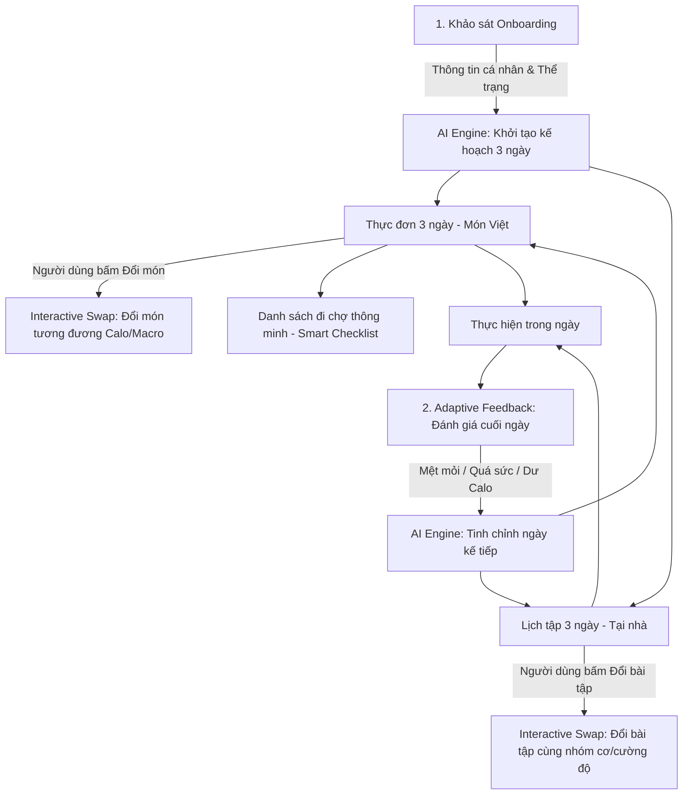

# BUSINESS REQUIREMENTS DOCUMENT (BRD)
## Dự án: SmartFit AI – Adaptive Meal & Workout Planner
**Tên sản phẩm:** Trợ lý AI Gợi ý & Điều chỉnh Thực đơn, Lịch tập Thông minh  
**Môn học:** AI Product Development End-to-End  
**Phiên bản:** 1.1.0  
**Ngày cập nhật:** 12/09/2026  
**Trạng thái:** Chính thức phê duyệt (Approved)

---

## 1. TỔNG QUAN DỰ ÁN (EXECUTIVE SUMMARY)

**SmartFit AI** là ứng dụng di động/web hỗ trợ quản lý sức khỏe cá nhân hóa, giúp tự động lập và điều chỉnh lịch trình ăn uống, tập luyện theo nhu cầu và thể trạng thực tế của từng người dùng. 

Thay vì cung cấp một bản kế hoạch dài hạn cố định, cứng nhắc (vốn là nguyên nhân hàng đầu khiến 80% người mới bỏ cuộc), SmartFit AI tiếp cận theo hướng **tương tác hai chiều linh hoạt (Human-in-the-loop & Adaptive Feedback)**. Ứng dụng tập trung vào chu kỳ kế hoạch **3 ngày cuốn chiếu (Rolling 3-Day Plan)** kết hợp các món ăn gia đình Việt Nam gần gũi, bài tập đơn giản tại nhà và danh sách đi chợ thông minh.

Dự án tuân thủ quy trình phát triển sản phẩm AI toàn diện chuẩn công nghiệp: từ phân tích yêu cầu nghiệp vụ (BRD/PRD), thiết kế Prompt với cấu trúc đầu ra chuẩn (Structured Output JSON), tích hợp REST API, đến kiểm thử tự động (Unit/Integration Test) và xây dựng tài liệu kỹ thuật hoàn chỉnh.

---

## 2. BÀI TOÁN & GIẢI PHÁP SẢN PHẨM (PROBLEM & SOLUTION)

### 2.1. Vấn đề thực tế của người dùng
1. **Kế hoạch mẫu quá xa rời thực tế:** Thực đơn trên mạng thường đòi hỏi nguyên liệu ngoại nhập, đắt tiền (cá hồi, măng tây, quả bơ...) hoặc chế biến nhạt nhẽo (ức gà luộc) không phù hợp thói quen ăn uống gia đình Việt Nam.
2. **Kế hoạch quá dài hạn gây nản lòng:** Lập kế hoạch 30 ngày rất dễ bị "vỡ trận" ngay tuần đầu tiên chỉ vì 1 buổi tiệc đột xuất hoặc 1 ngày mệt mỏi.
3. **Thiếu tính năng thay thế tương đương:** Khi không mua được nguyên liệu hoặc đau nhức một nhóm cơ, người dùng không biết cách tự tìm món ăn hay bài tập khác có giá trị tương đương.
4. **Bất tiện khi chuẩn bị nguyên liệu:** Khó khăn trong việc tính toán lượng thực phẩm cần mua cho nhiều ngày dẫn đến lãng phí hoặc thiếu hụt.

### 2.2. Giải pháp của SmartFit AI
* **Khảo sát cá nhân hóa sâu:** Đo lường thể trạng, mục tiêu và đặc biệt là các hạn chế thể chất (chấn thương, dị ứng).
* **Kế hoạch 3 ngày thực tế:** Tạo thực đơn món Việt thân quen, tiết kiệm và bài tập thể dục tại nhà (Home Workout không cần tạ).
* **Đổi món & đổi bài tập thông minh (Interactive Swap):** Đổi ngay lập tức món ăn hoặc động tác khác nhưng AI đảm bảo giữ nguyên giá trị Calo và Macro mục tiêu.
* **Vòng lặp thích ứng hàng ngày (Adaptive Feedback Loop):** Thu thập cảm nhận thể chất cuối ngày để tự động tinh chỉnh cường độ và dinh dưỡng cho ngày tiếp theo.
* **Danh sách đi chợ thông minh (Smart Grocery Checklist):** Tự động bóc tách và cộng dồn nguyên liệu của 3 ngày thành danh sách tích chọn đi chợ tiện lợi.

---

## 3. ĐỐI TƯỢNG NGƯỜI DÙNG MỤC TIÊU (TARGET AUDIENCE)

1. **Người đi làm / Nhân viên văn phòng bận rộn:** Cần bài tập tại nhà 15-25 phút, thực đơn cơm trưa văn phòng/gia đình dễ chuẩn bị, dễ thay đổi khi có lịch liên hoan đột xuất.
2. **Sinh viên / Người mới bắt đầu (Beginner):** Ngân sách ăn uống giới hạn, chỉ ăn được món Việt bình dân, chưa có kinh nghiệm đến phòng gym và cần hướng dẫn bài tập không cần dụng cụ.
3. **Người có hạn chế sức khỏe đặc thù:** Dị ứng thức ăn (hải sản, đậu phộng, lactose...), có tiền sử đau cổ tay, đau khớp gối cần tránh các động tác bật nhảy hoặc tì đè nặng.

---

## 4. CÁC TÍNH NĂNG CỐT LÕI (CORE FUNCTIONAL REQUIREMENTS)



### Feature 1: Khảo sát cá nhân hóa (Personalized Onboarding)
* **FR-1.1 (Chỉ số nhân trắc học):** Nhập tuổi, giới tính, chiều cao (cm), cân nặng hiện tại (kg).
* **FR-1.2 (Mục tiêu cá nhân):** Chọn 1 trong 3 mục tiêu rõ ràng: *Giảm mỡ (Cut)*, *Tăng cơ (Bulk)*, hoặc *Duy trì vóc dáng (Maintain)*.
* **FR-1.3 (Ràng buộc & Hạn chế):**
  * Dị ứng thực phẩm: Tích chọn các loại thực phẩm gây dị ứng (Hải sản, sữa/lactose, trứng, các loại hạt...).
  * Chấn thương / Vấn đề cơ xương khớp: Đau gối, đau lưng dưới, đau cổ tay, huyết áp...
* **FR-1.4 (Engine tính toán nền tảng):** Tự động tính toán chỉ số BMI, BMR (Mifflin-St Jeor) và TDEE khoa học để làm mốc năng lượng chuẩn cho AI.

### Feature 2: Khởi tạo kế hoạch 3 ngày (Rolling 3-Day Plan Generation)
* **FR-2.1 (Thực đơn món ăn Việt):** Sinh kế hoạch ăn uống 3 ngày liên tiếp gồm 3 bữa chính (Sáng, Trưa, Tối) và 1 bữa phụ (tùy chọn). Ưu tiên các món ăn Việt Nam gần gũi, quen thuộc (phở, bún, cơm gia đình, canh rau, thịt kho, cá hấp...).
* **FR-2.2 (Lịch tập tại nhà):** Lập lịch vận động 3 ngày với các bài tập Bodyweight/Calisthenics đơn giản, không cần tạ, phù hợp không gian phòng khách/phòng trọ, chỉ rõ số hiệp (sets), số lần (reps) hoặc thời gian (giây).
* **FR-2.3 (Bảo đảm dinh dưỡng):** Mỗi ngày đều có thông số hiển thị rõ ràng: Tổng Calo, tỉ lệ Protein - Carbs - Fat.

### Feature 3: Đổi món & Bài tập linh hoạt (Interactive Swap)
* **FR-3.1 (Đổi món ăn):** Người dùng có thể nhấn nút **"Đổi món"** tại bất kỳ bữa nào (do thiếu nguyên liệu hoặc không muốn ăn). AI lập tức sinh ra một món ăn thay thế đáp ứng:
  * Không chứa thực phẩm người dùng dị ứng.
  * Lượng Calo và Protein tương đương món cũ ($\pm 10\%$).
* **FR-3.2 (Đổi bài tập):** Người dùng nhấn nút **"Đổi bài tập"** nếu cảm thấy đau khớp hoặc không thực hiện được động tác. AI thay thế bằng một bài tập khác tác động cùng nhóm cơ nhưng áp lực thấp hơn.

### Feature 4: Tự điều chỉnh theo phản hồi (Adaptive Feedback)
* **FR-4.1 (Check-in cuối ngày):** Mỗi buổi tối, ứng dụng kích hoạt màn hình đánh giá nhanh (1-2 phút):
  * Mức độ hoàn thành thực đơn (Đúng kế hoạch / Ăn thiếu / Ăn lố calo).
  * Cảm nhận thể lực buổi tập: *Rất nhẹ / Vừa sức / Rất mệt, đuối sức*.
  * Tình trạng thể chất phát sinh: Đau nhức cơ bắp (DOMS), mất ngủ, stress...
* **FR-4.2 (Tinh chỉnh ngày kế tiếp):**
  * Nếu người dùng báo *Quá mệt/Đau cơ*: AI tự động giảm $20-30\%$ cường độ bài tập ngày hôm sau hoặc chuyển sang giãn cơ (stretching/yoga phục hồi).
  * Nếu người dùng báo *Lỡ ăn tiệc quá nhiều Calo*: AI điều chỉnh nhẹ nhàng giảm tinh bột và tăng rau xanh vào các bữa ngày mai để cân bằng năng lượng.

### Feature 5: Danh sách đi chợ thông minh (Smart Grocery Checklist)
* **FR-5.1 (Tự động bóc tách & tổng hợp):** Từ thực đơn 3 ngày đã tạo, hệ thống tự động bóc tách các thành phần nguyên liệu và gom nhóm (VD: Ức gà: 600g, Cải thìa: 500g, Trứng gà: 6 quả, Cà chua: 3 quả...).
* **FR-5.2 (Giao diện Checkbox tiện lợi):** Người dùng mang điện thoại đi siêu thị hoặc chợ, chạm để tích gạch đầu dòng các món đã mua xong, xóa nhanh nguyên liệu đã có sẵn trong tủ lạnh.

---

## 5. QUY TRÌNH PHÁT TRIỂN SẢN PHẨM AI TOÀN DIỆN (END-TO-END PIPELINE)

Để đáp ứng tiêu chuẩn cao nhất của đồ án môn học **AI Product Development**, dự án triển khai theo quy trình chuẩn:

| Giai đoạn | Công việc trọng tâm | Đầu ra (Deliverables) |
|---|---|---|
| **1. Product Requirements (PRD/BRD)** | Xác định phạm vi, user flow, quy định các trường thông tin dữ liệu. | File `BRD.md`, sơ đồ kiến trúc hệ thống, Database Schema. |
| **2. Prompt Engineering (AI Engine)** | Thiết kế System Prompt, ràng buộc **Structured Output JSON**, Few-shot món ăn Việt Nam, quy tắc toán học cân bằng Calo/Macro. | Bộ test prompt trong `ai_workspace/`, file định nghĩa Schema JSON (Pydantic / TypeScript Interfaces). |
| **3. API & Backend Integration** | Xây dựng REST API bằng FastAPI, định tuyến các endpoint Onboarding, Generate Plan, Swap Item, Adaptive Feedback, Grocery List. | Bộ mã nguồn `backend_api/` hoàn chỉnh, tài liệu Swagger UI (`/docs`). |
| **4. Frontend Development** | Xây dựng ứng dụng Flutter (`frontend_app/`), tích hợp State Management, gọi API Backend, thiết kế UX/UI hiện đại. | Giao diện mobile/web hoàn chỉnh, thao tác mượt mà. |
| **5. Testing & Quality Assurance** | Kiểm thử Unit Test (cho thuật toán BMR/TDEE & parser JSON), Integration Test (luồng Swap & Adaptive), kiểm tra trường hợp ngoại lệ. | Thư mục `test/` đạt độ phủ kiểm thử, báo cáo kiểm thử tự động. |
| **6. Technical Documentation** | Viết tài liệu hướng dẫn cài đặt, kiến trúc hệ thống, báo cáo đánh giá độ chính xác của AI. | File `README.md`, `ARCHITECTURE.md`, Slide báo cáo nộp môn học. |

---

## 6. THIẾT KẾ CẤU TRÚC ĐẦU RA AI (STRUCTURED OUTPUT JSON SCHEMA)

Mọi phản hồi từ AI Engine đều bắt buộc tuân theo định dạng JSON nguyên khối (không sinh kèm text tự do) để đảm bảo Backend và Flutter có thể parse trực tiếp 100% không gặp lỗi:

```json
{
  "plan_id": "smartfit_plan_001",
  "daily_target": {
    "target_calories": 1850,
    "protein_g": 130,
    "carbs_g": 180,
    "fat_g": 55
  },
  "days": [
    {
      "day_number": 1,
      "meals": [
        {
          "meal_type": "Breakfast",
          "name": "Bún bò Huế giò nạc (ít mỡ)",
          "portion": "1 bát vừa",
          "calories": 480,
          "macros": { "protein": 28, "carbs": 55, "fat": 16 },
          "ingredients": ["Bún tươi (150g)", "Bắp bò (80g)", "Chả lụa (30g)", "Hành, rau thơm"]
        }
      ],
      "workout": {
        "title": "Full Body Burn tại nhà",
        "duration_minutes": 20,
        "exercises": [
          {
            "name": "Squat tay không",
            "sets": 3,
            "reps": "15 lần",
            "rest_seconds": 45,
            "target_muscle": "Đùi & Mông"
          }
        ]
      }
    }
  ],
  "grocery_list": [
    { "category": "Thịt & Protein", "items": ["Bắp bò 250g", "Ức gà 500g", "Trứng gà 4 quả"] },
    { "category": "Rau củ", "items": ["Cải thìa 500g", "Cà chua 300g", "Hành lá 100g"] }
  ]
}
```

---

## 7. YÊU CẦU PHI CHỨC NĂNG (NON-FUNCTIONAL REQUIREMENTS)

1. **Hiệu năng (Performance):**
   * Tốc độ phản hồi tạo kế hoạch 3 ngày của AI: $< 4$ giây.
   * Tốc độ xử lý "Đổi món / Đổi bài tập" (Interactive Swap): $< 2$ giây.
2. **Độ tin cậy của AI (Reliability & Robustness):**
   * Tỷ lệ sinh đúng định dạng JSON đạt $\ge 99\%$ (áp dụng cơ chế Schema Validation của Pydantic).
   * Không bao giờ gợi ý thực phẩm thuộc danh sách dị ứng của người dùng (Safety Constraint).
3. **Tính tương thích (Compatibility):**
   * Backend chạy tương thích trên Python 3.10+ (hỗ trợ Windows, macOS, Linux).
   * Frontend chạy mượt mà trên Flutter Web và thiết bị di động (Android/iOS).

---

## 8. TIÊU CHÍ NGHIỆM THU MÔN HỌC (ACCEPTANCE CRITERIA)

* [x] **Tài liệu hoàn chỉnh:** Có đầy đủ BRD/PRD, tài liệu kiến trúc hệ thống và hướng dẫn chạy project.
* [ ] **Chức năng Onboarding:** Người dùng nhập thông số, hệ thống tính chuẩn BMR/TDEE.
* [ ] **Chức năng Sinh kế hoạch 3 ngày:** AI tạo thực đơn món Việt và bài tập tại nhà dưới dạng JSON chuẩn.
* [ ] **Chức năng Đổi món & Bài tập:** Nhấn nút là đổi được ngay phương án tương đương.
* [ ] **Chức năng Adaptive Feedback:** Nhập phản hồi cuối ngày, lịch ngày hôm sau được cập nhật tự động.
* [ ] **Chức năng Danh sách đi chợ:** Hiển thị danh sách nguyên liệu dạng Checklist tích chọn tiện lợi.
* [ ] **Kiểm thử tự động:** Có bộ Unit Test kiểm tra logic tính calo và kiểm thử phản hồi API.
