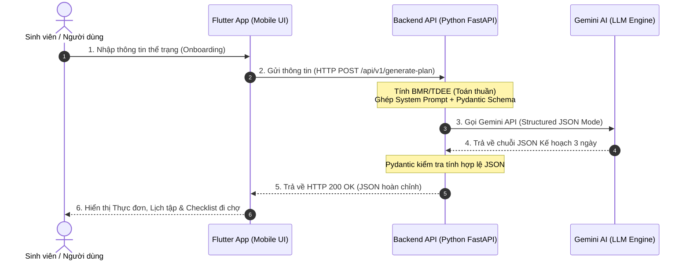

# BUSINESS REQUIREMENTS DOCUMENT (BRD)
## Dự án: SmartFit AI – Adaptive Meal & Workout Planner
**Tên sản phẩm:** Trợ lý AI Gợi ý & Điều chỉnh Thực đơn, Lịch tập Thông minh  
**Môn học:** AI Product Development End-to-End (Đồ án Kỹ sư / Cử nhân Năm 4)  
**Đơn vị thực hiện:** Trường Đại học Công nghệ Thông tin và Truyền thông Việt - Hàn (VKU)  
**Phiên bản:** 2.0.0 (Dành cho Sinh viên thực hành: Flutter & FastAPI)  
**Ngày cập nhật:** 13/09/2026  
**Trạng thái:** Đã phê duyệt (Approved)  

---

## 1. TỔNG QUAN DỰ ÁN (EXECUTIVE SUMMARY)

**SmartFit AI** là ứng dụng di động hỗ trợ quản lý sức khỏe cá nhân hóa, giúp tự động tạo và linh hoạt điều chỉnh lịch ăn uống, tập luyện theo nhu cầu và thể trạng thực tế của từng cá nhân. 

Thay vì cung cấp một kế hoạch 30 ngày cứng nhắc (nguyên nhân khiến 80% người mới bỏ cuộc), SmartFit AI tiếp cận theo hướng **tương tác hai chiều thân thiện (Human-in-the-loop & Adaptive Feedback)** với chu kỳ **3 ngày cuốn chiếu (Rolling 3-Day Plan)**:
* **Ăn uống:** Ưu tiên các món ăn gia đình Việt Nam bình dân, gần gũi, dễ mua, dễ nấu.
* **Tập luyện:** Bài tập thể dục tại nhà (Bodyweight/Calisthenics), không cần tạ hay dụng cụ đắt tiền.
* **Tiện ích:** Danh sách đi chợ thông minh (Checklist) gom nguyên liệu giúp sinh viên và người bận rộn mua sắm nhanh gọn.

> [!NOTE]
> **Định vị kỹ thuật của đồ án:** Dự án được thiết kế chuẩn chỉnh theo mô hình phát triển sản phẩm AI End-to-End nhưng được **tối ưu hóa cho sinh viên năm 4 mới tiếp cận Flutter và REST API**. Kiến trúc tinh gọn, dễ debug, dễ kiểm thử bằng giao diện Swagger UI trước khi tích hợp vào ứng dụng di động.

---

## 2. BÀI TOÁN & GIẢI PHÁP (PROBLEM & SOLUTION)

### 2.1. Vấn đề thực tế
1. **Thực đơn ngoại nhập khó áp dụng:** Các app quốc tế thường gợi ý yến mạch, măng tây, ức gà áp chảo, cá hồi... vừa đắt vừa khó duy trì với người Việt Nam.
2. **Kế hoạch quá dài hạn:** Kế hoạch 1 tháng dễ bị "vỡ trận" ngay tuần đầu khi có tiệc tùng, bận thi cử hoặc một ngày mệt mỏi.
3. **Không biết cách thay thế:** Khi hết nguyên liệu trong tủ lạnh hoặc đau cơ bắp, người dùng không biết chọn món nào hoặc bài tập nào tương đương để thay thế.
4. **Bối rối khi đi chợ:** Khó tính toán khối lượng thịt, rau cần mua cho 3 ngày tới, dẫn tới lãng phí thực phẩm.

### 2.2. Giải pháp của SmartFit AI
* **Khảo sát đơn giản & cá nhân:** Nhập chiều cao, cân nặng, mục tiêu và hạn chế (dị ứng, đau khớp).
* **Kế hoạch 3 ngày thực tế:** Tạo thực đơn món Việt và bài tập tại nhà 15–25 phút.
* **Đổi món & đổi bài tập thông minh (Interactive Swap):** Đổi ngay món hoặc bài tập khác tương đương lượng Calo/Macro chỉ bằng một chạm.
* **Ghi nhận phản hồi cuối ngày (Adaptive Feedback):** Báo mệt mỏi hoặc lỡ ăn nhiều để AI tự hạ cường độ hoặc cân bằng calo ngày hôm sau.
* **Danh sách đi chợ (Smart Checklist):** Tự động bóc tách nguyên liệu thành danh sách tích chọn đi chợ tiện lợi.

---

## 3. ĐỐI TƯỢNG NGƯỜI DÙNG MỤC TIÊU

1. **Sinh viên & Người mới đi làm:** Cần thực đơn tiết kiệm, bài tập nhanh tại phòng trọ/nhà ở không cần dụng cụ.
2. **Dân văn phòng bận rộn:** Cần ăn uống linh hoạt theo bữa cơm gia đình hoặc cơm văn phòng, có thể đổi món tức thì khi có lịch liên hoan đột xuất.
3. **Người có hạn chế thể lực:** Người bị đau cổ tay, đau khớp gối (cần tránh nhảy dây/burpee) hoặc dị ứng thức ăn (hải sản, trứng, sữa...).

---

## 4. KIẾN TRÚC HỆ THỐNG DÀNH CHO SINH VIÊN (END-TO-END ARCHITECTURE)

Dự án chọn công nghệ hiện đại, phổ biến trong tuyển dụng nhưng có đường cong học tập vừa sức cho sinh viên năm 4:



### Lựa chọn công nghệ chi tiết:
* **Frontend (Flutter):**
  * Thư viện mạng: Gói `http` cơ bản (dễ học hơn `dio` cho người mới).
  * State Management: `setState` hoặc `ChangeNotifier` / `Provider` (dễ hiểu, không cần học Bloc quá phức tạp lúc đầu).
  * Lưu trữ cục bộ: `shared_preferences` để lưu lại kế hoạch JSON, mở app lại không bị mất dữ liệu và giảm số lần gọi AI.
* **Backend (FastAPI - Python):**
  * Tốc độ phát triển cực nhanh, code ngắn gọn, tự động sinh tài liệu kiểm thử **Swagger UI** tại `http://127.0.0.1:8000/docs` giúp sinh viên test API ngay trên trình duyệt trước khi viết code Flutter.
* **AI Engine (Google Gemini API):**
  * Sử dụng model `gemini-1.5-flash` (hoặc `gemini-2.5-flash`): tốc độ phản hồi nhanh, miễn phí hạn mức cho sinh viên, hỗ trợ mạnh mẽ chế độ xuất cấu trúc JSON (`response_mime_type="application/json"`).

---

## 5. PHÂN CHIA TÍNH NĂNG THEO GIAI ĐOẠN (PROJECT SCOPE)

Để đảm bảo sinh viên hoàn thành đúng hạn đồ án môn học, các yêu cầu được chia thành 2 giai đoạn rõ ràng:

### Giai đoạn 1: MVP Cốt lõi (Bắt buộc hoàn thành để nộp đồ án)

#### FR-1: Khảo sát thông tin (Personalized Onboarding)
* **FR-1.1:** Giao diện Form nhập: Tuổi, giới tính, chiều cao (cm), cân nặng (kg).
* **FR-1.2:** Chọn mục tiêu: *Giảm mỡ (Cut)*, *Tăng cơ (Bulk)*, hoặc *Duy trì vóc dáng (Maintain)*.
* **FR-1.3:** Tích chọn hạn chế: Dị ứng thực phẩm (Hải sản, trứng, sữa...), Chấn thương (Đau gối, đau lưng...).
* **FR-1.4 (Logic Deterministic):** Backend tự tính chỉ số BMI, BMR (công thức Mifflin-St Jeor) và TDEE khoa học.

#### FR-2: Khởi tạo kế hoạch 3 ngày (Rolling 3-Day Plan)
* **FR-2.1 (Thực đơn món Việt):** 3 ngày, mỗi ngày 3 bữa chính (Sáng, Trưa, Tối). Món ăn quen thuộc (phở, bún thịt nạc, canh rau ngót, trứng luộc...).
* **FR-2.2 (Bài tập tại nhà):** Lịch tập 3 ngày gồm các động tác Bodyweight (Squat, chống đẩy khuỵu gối, plank...), ghi rõ số hiệp (sets) và số lần (reps).
* **FR-2.3 (Hiển thị Calo):** Hiển thị tổng Calo dự tính và phân bổ Protein / Carbs / Fat mỗi ngày.

#### FR-3: Danh sách đi chợ thông minh (Smart Grocery Checklist)
* **FR-3.1:** Tổng hợp các nguyên liệu nấu ăn của cả 3 ngày thành danh sách nhóm (Rau củ, Thịt trứng, Gia vị).
* **FR-3.2:** Hiển thị danh sách Checkbox trong Flutter, cho phép người dùng chạm để đánh dấu đã mua hoặc xóa món đã có sẵn trong tủ lạnh.

---

### Giai đoạn 2: Tính năng Nâng cao (Điểm cộng & Đánh giá cao khi bảo vệ)

#### FR-4: Đổi món & Đổi bài tập (Interactive Swap)
* **FR-4.1:** Nhấn nút "Đổi món" tại một bữa ăn $\rightarrow$ Backend gọi AI sinh 1 món ăn khác có mức calo tương đương ($\pm 10\%$), không chứa thành phần dị ứng.
* **FR-4.2:** Nhấn nút "Đổi bài tập" $\rightarrow$ AI gợi ý động tác khác nhẹ hơn cùng tác động lên nhóm cơ đó.

#### FR-5: Đánh giá thích ứng cuối ngày (Adaptive Feedback)
* **FR-5.1:** Form đánh giá nhanh cuối ngày (1 phút):
  * Cảm nhận thể lực: *Nhẹ nhàng / Vừa sức / Rất mệt*.
  * Ăn uống: *Đúng thực đơn / Ăn thiếu / Lỡ ăn tiệc quá nhiều*.
* **FR-5.2:** AI điều chỉnh kế hoạch ngày tiếp theo (giảm bớt bài tập nếu quá mệt, tăng rau xanh giảm tinh bột nếu lỡ ăn tiệc).

---

## 6. THIẾT KẾ CẤU TRÚC ĐẦU RA AI (STRUCTURED OUTPUT JSON SCHEMA)

Để Flutter không bị lỗi parse dữ liệu, Backend cấu hình Gemini API trả về cấu trúc JSON chuẩn mực, dễ ánh xạ sang Model trong Dart:

```json
{
  "plan_id": "smartfit_plan_demo_01",
  "daily_target": {
    "target_calories": 1850,
    "protein_g": 110,
    "carbs_g": 200,
    "fat_g": 50
  },
  "days": [
    {
      "day_number": 1,
      "day_name": "Ngày 1",
      "meals": [
        {
          "meal_id": "m1_1",
          "meal_type": "Bữa sáng",
          "name": "Bún thịt bò nạc",
          "portion": "1 tô vừa",
          "calories": 420,
          "protein_g": 25,
          "ingredients": ["Bún tươi (150g)", "Thịt bò nạc (70g)", "Rau thơm, hành lá"]
        },
        {
          "meal_id": "m1_2",
          "meal_type": "Bữa trưa",
          "name": "Cơm trắng, ức gà xào nấm, canh cải ngọt",
          "portion": "1 chén cơm + 1 đĩa thức ăn",
          "calories": 650,
          "protein_g": 40,
          "ingredients": ["Gạo tẻ (100g)", "Ức gà (150g)", "Nấm rơm (50g)", "Rau cải ngọt (150g)"]
        },
        {
          "meal_id": "m1_3",
          "meal_type": "Bữa tối",
          "name": "Cá hấp hành gừng, canh bí đỏ thịt băm",
          "portion": "1 phần vừa",
          "calories": 520,
          "protein_g": 35,
          "ingredients": ["Cá điêu hồng/cá quả (150g)", "Bí đỏ (100g)", "Thịt nạc băm (40g)"]
        }
      ],
      "workout": {
        "title": "Vận động toàn thân tại nhà",
        "duration_minutes": 20,
        "exercises": [
          {
            "exercise_id": "e1_1",
            "name": "Jumping Jacks (Khởi động)",
            "sets": 2,
            "reps_or_duration": "30 giây",
            "target_muscle": "Tim mạch & Khởi động"
          },
          {
            "exercise_id": "e1_2",
            "name": "Squat tay không",
            "sets": 3,
            "reps_or_duration": "12-15 lần",
            "target_muscle": "Đùi & Mông"
          },
          {
            "exercise_id": "e1_3",
            "name": "Chống đẩy khuỵu gối (Knee Push-ups)",
            "sets": 3,
            "reps_or_duration": "10-12 lần",
            "target_muscle": "Ngực & Tay sau"
          }
        ]
      }
    }
  ],
  "grocery_list": [
    {
      "category": "Thịt & Thủy hải sản",
      "items": ["Thịt bò nạc (70g)", "Ức gà (450g)", "Thịt nạc băm (120g)", "Cá tươi (400g)"]
    },
    {
      "category": "Rau củ quả",
      "items": ["Rau cải ngọt (500g)", "Bí đỏ (300g)", "Nấm rơm (150g)", "Hành, gừng, rau thơm"]
    },
    {
      "category": "Lương thực & Gia vị",
      "items": ["Gạo tẻ", "Bún tươi (150g)", "Dầu ăn, nước mắm, hạt nêm"]
    }
  ]
}
```

> [!TIP]
> **Hướng dẫn cho sinh viên tạo Dart Model nhanh:**
> Bạn chỉ cần copy đoạn JSON mẫu ở trên, dán vào trang web chuyển đổi miễn phí `quicktype.io` (chọn language là **Dart**), hệ thống sẽ tự sinh toàn bộ class Dart kèm hàm `fromJson` và `toJson` chuẩn xác để dùng ngay trong Flutter!

---

## 7. YÊU CẦU PHI CHỨC NĂNG THỰC TẾ (STUDENT-FRIENDLY NFRS)

1. **Trải nghiệm người dùng (UX & Loading State):**
   * Do gọi mô hình ngôn ngữ lớn (LLM) qua mạng thường mất từ **3 – 6 giây**, Flutter **bắt buộc phải có hiệu ứng chờ thân thiện** (Loading Spinner, thanh tiến trình hoặc câu thông báo vui nhộn như *"SmartFit đang chuẩn bị thực đơn món Việt cho bạn..."*), tránh để màn hình trắng đơ khiến người dùng tưởng ứng dụng bị treo.
2. **Xử lý sự cố đơn giản (Graceful Fallback):**
   * Nếu người dùng mất mạng hoặc Gemini API gặp sự cố giới hạn (Rate limit), Backend sẽ trả về mã lỗi dễ hiểu thay vì làm crash ứng dụng Flutter.
   * Cung cấp sẵn một file `sample_plan.json` dự phòng để phục vụ việc demo thuyết trình trơn tru ngay cả khi mạng trường bị yếu.
3. **Môi trường chạy đơn giản (Local Environment):**
   * Backend chạy trực tiếp trên máy cá nhân bằng lệnh `uvicorn main:app --reload` (Python 3.10+).
   * Flutter chạy mượt mà trên Chrome (Flutter Web) hoặc máy ảo Android / điện thoại thật qua cáp USB.

---

## 8. KẾ HOẠCH TRIỂN KHAI THEO TUẦN (WEEKLY ROADMAP CHO ĐỒ ÁN)

| Tuần | Mục tiêu chính | Đầu ra cần đạt (Deliverables) |
|:---|:---|:---|
| **Tuần 1** | **Chốt yêu cầu & Thiết kế Prompt** | Hoàn thiện file `BRD.md`; viết thử nghiệm script Python gọi Gemini API sinh JSON trong `ai_workspace/`. |
| **Tuần 2** | **Xây dựng Backend (FastAPI)** | Hoàn thiện 2 endpoint chính (`/generate-plan`, `/health`) trong `backend_api/`; test thử nghiệm thành công trên Swagger UI (`/docs`). |
| **Tuần 3** | **Xây dựng Giao diện Flutter (MVP)** | Tạo màn hình Onboarding (Form nhập tuổi, chiều cao, cân nặng) và màn hình hiển thị kế hoạch 3 ngày trong `frontend_app/`. |
| **Tuần 4** | **Kết nối API (Integration) & Checklist** | Flutter gọi API Backend hiển thị dữ liệu thật; hoàn thiện tính năng Danh sách đi chợ (Checkbox). |
| **Tuần 5** | **Hoàn thiện tính năng nâng cao & Demo** | Thêm nút "Đổi món" (Swap); viết Unit Test cho thuật toán BMR; hoàn thiện slide báo cáo và video quay demo nộp môn học. |

---

## 9. TIÊU CHÍ NGHIỆM THU MÔN HỌC (RUBRIC CHECKLIST)

* [x] **Tài liệu đặc tả (BRD/PRD):** Rõ ràng bài toán, kiến trúc, sơ đồ luồng và cấu trúc JSON.
* [ ] **Module AI Engine (`ai_workspace/`):** Có prompt chuyên biệt cho món ăn Việt và cấu hình Structured Output JSON chuẩn.
* [ ] **Module Backend (`backend_api/`):** FastAPI chạy được local, có Swagger UI trực quan, tính đúng công thức BMR/TDEE.
* [ ] **Module Frontend (`frontend_app/`):** Ứng dụng Flutter nhập được thông số, có hiệu ứng loading khi chờ AI, hiển thị đẹp mắt thực đơn 3 ngày.
* [ ] **Tính năng Checklist:** Người dùng tích chọn được các nguyên liệu khi đi chợ.
* [ ] **Demo & Báo cáo:** Demo chạy thông suốt từ Client $\rightarrow$ Server $\rightarrow$ AI $\rightarrow$ Client.
